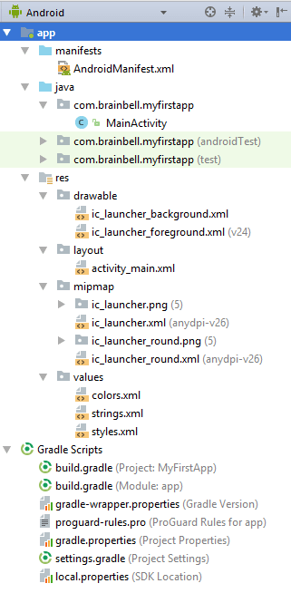

# Pengenalan Android, Android Studio, dan XML


## Android

Kita pasti sudah mengenal apa itu Android, setiap hari pasti ada teman kita, keluarga kita, ataupun malah kita sendiri yang menggunakan sistem operasi mobile ini. Jika kita melihat dari [web resminya](https://www.android.com/what-is-android/), android memiliki beberapa definisi:

- Platform yang dapat mengubah apa yang device mobile dapat lakukan
- Pemberi kekuatan ke HP, tablet, jam tangan, TV, dan mobil
- Selalu mendorong apa saja yang mungkin dilakukan oleh device
- Mengamankan HP Anda dengan built-in security
- Anda dapat mengontrol data Anda dengan bebas
- Pemberi keseimbangan yang tepat untuk device Anda
- Teknologi yang sangat berguna bagi siapapun

## Android Studio


Android Studio merupakan salah satu IDE yang paling umum digunakan untuk pengembangan aplikasi Android. Android Studio memiliki sangat banyak fitur yang sangat memudahkan pengembangan aplikasi Android. Langkah-langkah agar bisa mengistall dan menggunakan Android Studio bisa dilihat pada [link ini](https://developer.android.com/studio/install), kami tidak menjabarkan disini karena disana Anda lebih bisa menyesuaikan sesuai OS Anda sendiri. Lalu untuk pengenalan tools apa saja yang terdapat di Android Studio bisa dilihat pada [link ini](https://developer.android.com/studio/intro).

## Struktur File di Android Studio



### Manifest Folder

Disini adalah tempat dimana file manifest ditempatkan. File manifest adalah file yang mengadung parameter konfigurasi dari project seperti permissions, services, dan library tambahan. File ini akan digenerate otomatis oleh sistem ketika Anda pertama kali membuat project. Sebuah aplikasi sendiri bisa memiliki banyak file manifest karena versioning aplikasi, untuk mendukung versi hardware yang spesifik.

### Java Folder

Folder ini adalah tempat dimana Anda akan menyimpan semua source code aplikasi Anda. Kalaupun Anda menulis program Anda dalam bahasa Kotlin, nama dari folder ini tetap tidak berubah.

### Res Folder

Folder ini berguna untuk memisahkan dan mengatur resource untuk aplikasi Anda. Setiap tipe file harus dimasukkan ke folder yang sesuai dengan standar pengembangan Android. Saat pertama kali project terbentuk, beberapa folder akan otomatis tersedia, walaupun folder-folder tersebut bukan hanya yang bisa kamu gunakan dalam project.

### Gradle Scripts

File APK sendiri akan dibangun dengan gradle build system, dimana system ini terintegrasi dengan Android Studio. Ketika membuat project, gradle build akan otomatis dibuatkan. Jika kamu memiliki kebutuhan spesial untuk project-mu, maka kamu bisa menspesifikan disini. 

## XML


Dalam Pemrograman Android, kita pasti akan banyak sekali menggunakan XML. Dikutip dari [web resmi organisasinya](https://www.xml.com/pub/a/98/10/guide0.html#AEN63) XML memiliki definisi adalah bahasa markup untuk dokumen yang mengandung informasi yang terstruktur. Informasi yang terstruktur tersebut mengandung konten (kata, gambar, dll) dan beberapa informasi peran apa yang dimainkan oleh konten tersebut. 

### Apakah XML Sama Dengan HTML?

Tidak, di HTML tag yang digunakan sudah pakem atau pasti. `<h1>` selalu merupakan heading dengan ukuran besar dan tag `<ati.product.code>` tidak memiliki arti. Sedangkan XML tidak menspesifikkan aturan maupun set dai tag. Dengan kata lain, XML sendiri menfasilitasi untuk pendefinisian tag dan struktur di antara mereka. 

### Apa Kegunaan XML di Android?

Ada beberapa kegunaan XML di Android, diantaranya :

- Untuk menata layout dari aplikasi yang kita buat
- Sebagai sumber resource yang mendefinisikan value tertentu seperti kalimat, warna, maupun data
- Melakukan styling terhadap layout kita agar lebih menarik
- Dan masih banyak lagi

### Contoh

```
<?xml version="1.0" encoding="utf-8"?>
<LinearLayout xmlns:android="http://schemas.android.com/apk/res/android"
              android:layout_width="match_parent"
              android:layout_height="match_parent"
              android:orientation="vertical" >
    <TextView android:id="@+id/text"
              android:layout_width="wrap_content"
              android:layout_height="wrap_content"
              android:text="Hello, I am a TextView" />
    <Button android:id="@+id/button"
            android:layout_width="wrap_content"
            android:layout_height="wrap_content"
            android:text="Hello, I am a Button" />
</LinearLayout>
```

Contoh di atas merupakan salah satu contoh dari XML yang saya ambil langsung dari [web tutorial Android dari Google](https://developer.android.com/guide/topics/ui/declaring-layout). Jika kita perhatikan memang XML terasa mirip dengan HTML, tetapi dari contoh tersebut kita bisa melihat beberapa perbedaan :

- Berbeda dengan HTML yang diawali oleh tag `<!DOCTYPE html>` yang menandakan bahwa itu adalah dokumen HTML, XML disini menggunakan tag `<?xml version="1.0" encoding="utf-8"?>` yang menandakan bahwa ini adalah dokumen XML
- Penamaan Tag yang terkesan sangat beragam. Disini dapat kita lihat XML sendiri sudah memiliki 3 tag berbeda, dan seiring waktu kamu akan menemui banyak sekali jenis tag yang lain dan pada suatu titik kamu akan mendefinisikan tag mu sesuai kebutuhan mu saat itu
- Pendefinisian sifat-sifat dari tag yang didefinisikan langsung ke tag yang bersangkutan. Berbeda dengan HTML dimana kamu harus mendefinisikan sifat dari tag tertentu dengan style. Walaupun nanti Anda akan belajar untuk menyederhanakan pendefinisian sifat dari tag XML, untuk saat ini kita akan gunakan pendefinisian yang mirip seperti contoh.

Sebenarnya, selain digunakan untuk Android, XML sendiri juga banyak digunakan untuk keperluan lain seperti pengiriman data, tuning di server, layouting di device lain, dan masih banyak lagi.

### Sumber

- https://www.android.com/what-is-android/
- https://developer.android.com/studio/install
- https://developer.android.com/studio/intro 
- https://www.xml.com/pub/a/98/10/guide0.html#AEN63
- https://developer.android.com/guide/topics/ui/declaring-layout
- https://www.brainbell.com/android/file-folder-structure.html