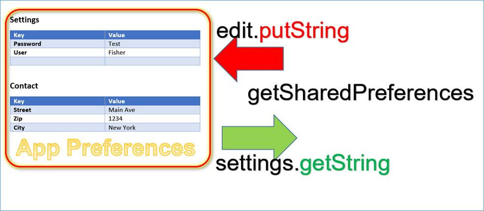

# SQLite & SharedPreferences

## SQLite


Android sendiri menyediakan beberapa metode penyimpanan data, diantaranya dengan menggunakan Database SQLite. SQLite merupakan solusi penyimpanan yang sangat bagus karena jika Anda mamiliki memiliki data terstruktur yang perlu diakses dan disimpan secara persisten serta sering ditelusuri dan diubah. Anda juga bisa menggunakan SQLite sebagai media penyimpanan utama untuk data aplikasi atau pengguna, proses caching, atau mengambil data dari cloud.

Cara menggunakan SQLite sendiri mirip dengan database SQL lainnya yaitu menggunakan suatu query. Tetapi oleh Android hal ini cukup dipermudah sehingga tidak perlu benar-benar menuliskan query.

### Mendefinisikan Schema dan Contract

Disini kita akan mendefinisikan seperti apa bentuk dari tabel yang akan dibuat. Untuk `_id` sendiri akan otomatis dibuatkan.

```kotlin
object FeedReaderContract {
    // Table contents are grouped together in an anonymous object.
    object FeedEntry : BaseColumns {
        const val TABLE_NAME = "entry"
        const val COLUMN_NAME_TITLE = "title"
        const val COLUMN_NAME_SUBTITLE = "subtitle"
    }
}
```

### Create DB Mengguanakan Helper

Lalu kita akan menjalankan perintah create untuk database. Kita akan menggunakan bantuan suatu class yaitu SQLiteOpenHelper. Selain membantu pembuatan, helper ini juga akan membantu jika ingin melakukan upgrade DB.

```kotlin
class FeedReaderDbHelper(context: Context) : SQLiteOpenHelper(context, DATABASE_NAME, null, DATABASE_VERSION) {
    private const val SQL_CREATE_ENTRIES =
        "CREATE TABLE ${FeedEntry.TABLE_NAME} (" +
                "${BaseColumns._ID} INTEGER PRIMARY KEY," +
                "${FeedEntry.COLUMN_NAME_TITLE} TEXT," +
                "${FeedEntry.COLUMN_NAME_SUBTITLE} TEXT)"

    private const val SQL_DELETE_ENTRIES = "DROP TABLE IF EXISTS ${FeedEntry.TABLE_NAME}"

    override fun onCreate(db: SQLiteDatabase) {
        db.execSQL(SQL_CREATE_ENTRIES)
    }
    override fun onUpgrade(db: SQLiteDatabase, oldVersion: Int, newVersion: Int) {
        // This database is only a cache for online data, so its upgrade policy is
        // to simply to discard the data and start over
        db.execSQL(SQL_DELETE_ENTRIES)
        onCreate(db)
    }
    override fun onDowngrade(db: SQLiteDatabase, oldVersion: Int, newVersion: Int) {
        onUpgrade(db, oldVersion, newVersion)
    }
    companion object {
        // If you change the database schema, you must increment the database version.
        const val DATABASE_VERSION = 1
        const val DATABASE_NAME = "FeedReader.db"
    }
}
```

Lalu untuk dapat mengakses database, maka kita akan membuat object dari class tadi.

```kotlin
val dbHelper = FeedReaderDbHelper(context)
```

### Memasukkan Data ke Database

Kita bisa melakukan insert data ke Database dengan passing sebuah object `ContentValues` ke fungsi `insert()`.

```kotlin
// Gets the data repository in write mode
val db = dbHelper.writableDatabase

// Create a new map of values, where column names are the keys
val values = ContentValues().apply {
    put(FeedEntry.COLUMN_NAME_TITLE, title)
    put(FeedEntry.COLUMN_NAME_SUBTITLE, subtitle)
}

// Insert the new row, returning the primary key value of the new row
val newRowId = db?.insert(FeedEntry.TABLE_NAME, null, values)
```

### Mendapatkan Data dari Database

Untuk mendapatkan data dari database, maka gunakan fungsi `query()`, dan masukkan kriteria seleksi dan kolom yang diinginkan. Hasil dari query akan dikembalikan sebagai object `Cursor`.

```kotlin
val db = dbHelper.readableDatabase

// Define a projection that specifies which columns from the database
// you will actually use after this query.
val projection = arrayOf(BaseColumns._ID, FeedEntry.COLUMN_NAME_TITLE, FeedEntry.COLUMN_NAME_SUBTITLE)

// Filter results WHERE "title" = 'My Title'
val selection = "${FeedEntry.COLUMN_NAME_TITLE} = ?"
val selectionArgs = arrayOf("My Title")

// How you want the results sorted in the resulting Cursor
val sortOrder = "${FeedEntry.COLUMN_NAME_SUBTITLE} DESC"

val cursor = db.query(
        FeedEntry.TABLE_NAME,   // The table to query
        projection,             // The array of columns to return (pass null to get all)
        selection,              // The columns for the WHERE clause
        selectionArgs,          // The values for the WHERE clause
        null,                   // don't group the rows
        null,                   // don't filter by row groups
        sortOrder               // The sort order
)
```

Lalu untuk mendapat data dari `Cursor`, kita bisa memanggil beberapa fungsi bawaan dari `Cursor`. Contohnya adalah fungsi `moveToNext()`.

```kotlin
val itemIds = mutableListOf<Long>()
with(cursor) {
    while (moveToNext()) {
        val itemId = getLong(getColumnIndexOrThrow(BaseColumns._ID))
        itemIds.add(itemId)
    }
}
```

### Menghapus Data di Database

Untuk menghapus data, kita akan menggunakan fungsi `delete()` dan memasukka kriteria seleksi ke dalamnya.

```kotlin
// Define 'where' part of query.
val selection = "${FeedEntry.COLUMN_NAME_TITLE} LIKE ?"
// Specify arguments in placeholder order.
val selectionArgs = arrayOf("MyTitle")
// Issue SQL statement.
val deletedRows = db.delete(FeedEntry.TABLE_NAME, selection, selectionArgs)
```

### Update Data di Database

Untuk update suatu data di database, maka kita bisa menggunakan fungsi `update()`

```kotlin
val db = dbHelper.writableDatabase

// New value for one column
val title = "MyNewTitle"
val values = ContentValues().apply {
    put(FeedEntry.COLUMN_NAME_TITLE, title)
}

// Which row to update, based on the title
val selection = "${FeedEntry.COLUMN_NAME_TITLE} LIKE ?"
val selectionArgs = arrayOf("MyOldTitle")
val count = db.update(
        FeedEntry.TABLE_NAME,
        values,
        selection,
        selectionArgs)
```

### Mempertahankan Koneksi ke Database

Karena fungsi `getWritableDatabase()` dan `getReadableDatabase()` cukup mahal untuk dipanggil ketika database dalam kondisi tertutup. Maka usahakan untuk membiarkan koneksi selama mungkin selama ada kemungkinan untuk mengaksesnya kembali. Solusi paling optimal biasanya adalah untuk menutup database di fungsi `onDestroy()` di activity.

```kotlin
override fun onDestroy() {
    dbHelper.close()
    super.onDestroy()
}
```

## SharedPreferences



Jika Anda memiliki sejumlah kecil data dengan bentuk `key-value` untuk disimpan, `SharedPreferences` bisa menjadi solusi. Object dari `SharedPreferences` menyimpan data dengan format `key-value` dan menyediakan metode sederhana untuk menulis atau membaca data tersebut. Biasanya `SharedPreferences` sendiri digunakan untuk data pada halaman setting, dimana data di halaman ini biasanya cukup sederhana.

### Mendapatkan Object SharedPreferences

Anda bisa membuat object `SharedPreferences` baru atau memanggil yang sudah ada dengan fungsi `getSharedPreferences()`.

```kotlin
val sharedPref = activity?.getPreferences(Context.MODE_PRIVATE)
```

### Menaruh Data ke SharedPreferences

Kita bisa menulis data ke `SharedPreferences` dengan membuat suatu object `SharedPreferences.Editor` dengan memanggil fungsi `edit()` di `SharedPreferences` yang sudah ada. Taruh data dengan fungsi `putInt()` maupun `putString()` dengan menyediakan key dari data, lalu panggil `apply()` atau `commit()` untuk menyimpan perubahan.

```kotlin
val sharedPref = activity?.getPreferences(Context.MODE_PRIVATE) ?: return
with (sharedPref.edit()) {
    putInt(getString(R.string.saved_high_score_key), newHighScore)
    apply()
}
```

`commit()` menyimpan data dengan synchronous, sedangkan `apply()` menyimpan data secara asynchronous.

### Membaca Data di SharedPreferences

Untuk mendapat data dari `SharedPreferences`, kita bisa menggunakan fungsi `getInt()` dan `getString()` dengan menyediakan key dari data yang kita inginkan dan juga bisa menambahkan default value jika data yang diinginkan tidak ada.

```kotlin
val sharedPref = activity?.getPreferences(Context.MODE_PRIVATE) ?: return
val defaultValue = resources.getInteger(R.integer.saved_high_score_default_key)
val highScore = sharedPref.getInt(getString(R.string.saved_high_score_key), defaultValue)
```

## Sumber

- https://developer.android.com/training/data-storage/sqlite
- https://medium.com/easyread/konsep-dasar-database-sqlite-pada-android-e9445558f494
- https://developer.android.com/training/data-storage/shared-preferences