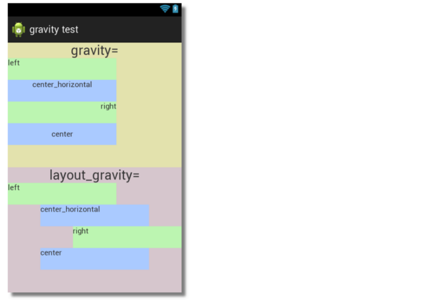

# Layout, Views, dan ViewGroup

Saat membuat aplikasi Android, tampilan merupakan salah satu hal yang benar-benar dibuat dengan matang. Jika aplikasi memiliki penampilan menarik dan tidak membingungkan pengguna, pasti pengguna akan betah dalam menggunakan aplikasi tersebut. Sekarang kita akan membahas beberapa elemen dalam tampilan aplikasi Android. 

## Layout

Layout struktur dari antarmuka untuk pengguna di aplikasi Anda. Semua elemen pada layout dibuat dengan hierarki View dan ViewGroup yang akan kita pelajari lebih dalam nanti. 


Diatas adalah sedikit penggambaran hierarki layout dalam aplikasi Android. Layout sendiri dapat di deklarasikan dengan 2 cara :

- **Deklarasikan elemen UI dalam XML**. Android menyediakan kosakata XML sederhana yang sesuai dengan kelas dan subkelas tampilan. Anda juga bisa menggunakan editor layout untuk membuat layout XML dengan sistem drag and drop.
- **Buat instance elemen layout saat waktu proses**. Aplikasi Anda bisa membuat objek View dan ViewGroup melalui program. 

Dengan mendeklarasikan layout dengan XML, Anda bisa memisahkan presentasi aplikasi dari kode yang mengontrol perilakunya. Menggunakan layout XML juga mempermudah dalam menyediakan layout yang berbeda untuk orientasi dan ukuran layar yang berbeda.

## View

Sebuah View meliputi sebuah area berbentuk persegi panjang di layar dan bertanggung jawab dalam penggambaran dan event handling. Kelas `View` merupakan superclass dari semua komponen GUI di Android. Beberapa View yang sering dipakai :

- `EditText`
- `ImageView`
- `TextView`
- `Button`
- `ImageButton`
- `CheckBox`

View sendiri memiliki beberapa atribut yang umum, diantaranya :

- `id`, digunakan untuk memberi tanda spesifik kepada suatu View sehingga mempermudah pencarian View tersebut di layout.
  Syntax : `android:id="@+id/my_id"`

- `height & width`, digunakan untuk mendefinisikan tinggi dan lebar dari suatu elemen View
  Syntax : `android:layout_width="match_parent"`, `android:layout_height="match_parent"`

- `padding & margin`, padding adalah jarak antara border ke konten dari elemen, sedangkan margin merupakan jarak antara border elemen ke elemen lain. Di bawah ini merupakan penggambaran lebih jelas mengenai padding dan margin
  


Syntax : `android:padding="10dp" android:layout_margin="10dp"`

- `gravity & layout_gravity`, gravity mengatur alignment dari content View, sedangkan layout_gravity mengatur alignment dari View itu terhadap parent-nya. Untuk penggambaran lebih jelasnya



Syntax : `android:gravity="center" android:layout_gravity="center"`

- `text`, mengatur text yang ditampilkan ke View
  Syntax : `android:text="Click me!"`

- `src`, mengatur konten yang akan ditampilkan ke ImageView
  Syntax : `android:src="@drawable/firstpic"`

Selain atribut-atribut tersebut, masih banyak lagi atribut-atribut lain dengan kegunaan yang bermacam-macam

## ViewGroup

ViewGroup adalah View spesial yang bisa mengandung View lain (disebut dengan children). `ViewGroup` merupakan base class untuk layout dan View container. Android memiliki beberapa ViewGroup yang sering digunakan seperti :

### Linear Layout


Layout yang mengatur View lain secara horizontal di satu kolom atau vertikal di satu baris. Dibawah ini adalah contoh dari penggunaan Linear Layout :

```
<LinearLayout xmlns:android="http://schemas.android.com/apk/res/android"
   android:layout_width="match_parent"
   android:layout_height="match_parent"
   android:orientation="horizontal">   <!-- Include other widget or layout tags here. These are considered
"child views" or "children" of the linear layout --> </LinearLayout>
```

Kita bisa mengatur di `android:orientation` apakah children nya ditampilkan secara vertikal atau horizontal

### Relative Layout

RelativeLayout adalah ViewGroup yang menampilkan children dengan posisi relatif. Posisi dari setiap View dapat diatur relatif terhadap sibling element nya (Seperti di left-of atau below View lain) atau di posisi relatif terhadap parent (align ke bottom, left, maupun center).


### Frame Layout

FrameLayout didesain untuk memblok area di layar agar menampilkan suatu item.  View dari child ditaruh seperti stack, dimana child paling baru ditaruh paling atas.


### ScrollView

ViewGroup yang membuat child didalamnya diatur dengan hierarki agar bisa di scroll. ScrollView hanya bisa digunakan untuk direct child. Jika ingin menggunakan banyak View, Maka gunakan ViewGroup lain. `ScrollView` hanya mendukung scroll dengan arah vertikal, jika ingin menggunakan scroll secara horizontal, gunakan `HorizontalScrollView`. Berikut adalah contoh kode untuk ScrollView :

```
<ScrollView xmlns:android="http://schemas.android.com/apk/res/android"
    android:layout_width="match_parent"
    android:layout_height="match_parent"
    android:fillViewport="true">
    
    <!-- everything you already have -->
    
</ScrollView>
```


## Penutup

Selain View yang sudah disediakan oleh Android secara default, Anda bisa membuat View Anda secara custom seperti yang dicontohkan [disini](https://developer.android.com/guide/topics/ui/custom-components)

## Sumber :

- https://developer.android.com/guide/topics/ui/declaring-layout
- https://medium.com/@geekanamika/android-beginners-views-layouts-657a5bbeebe2