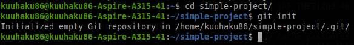
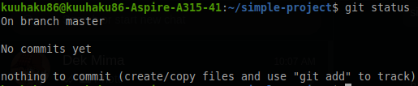
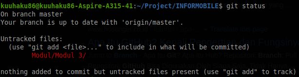
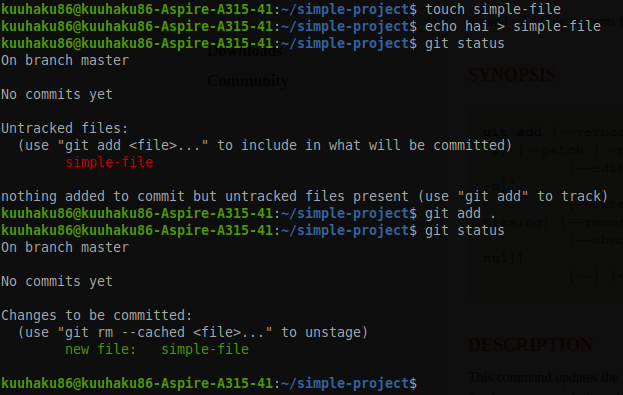
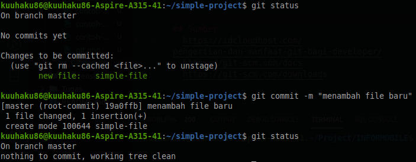

# Git dan Github

## Git


Ketika Anda mengembangkan sebuah software sendiri, mungkin tidak sulit untuk mengingat perubahan-perubahan yang telah dilakukan ke software tersebut. Tetapi ketika Anda mengembangkan software dengan teman-teman Anda atau bahkan dengan developer di seluruh dunia, melihat perubahan-perubahan pada software tersebut akan menjadi sangat sulit. Disinilah diciptakan sebuah sistem yang bernama *version control system*, dimana sistem ini membantu semua developer yang bekerja pada software mengetahui perubahan-perubahan apa saja yang telah dilakukan ke suatu software. Git merupakan *version control system* yang paling terkenal saat ini. Selain karena kemudahannya, Git menjadi terkenal karena komunitas nya sangatlah besar. Disini kita akan belajar sedikit mengenai penggunaan git. Git sendiri sebenarnya berbasis CLI (*Command Line Interface*), tetapi sekarang sudah sangat banyak tool ber-GUI (*Graphic User Interface*) yang dapat memudahkan para developer dalam menggunakan Git. Sebelum menggunakan Git, pastikan Git sudah terinstal di OS kalian. Sekarang kita akan belajar mengenai command-command di Git ketika kamu bekerja secara lokal (komputer-mu sendiri).

## Command git untuk bekerja di lokal

### *git init*
Ketika ingin project kita ter-track oleh Git, maka kita perlu menginisialisasi git ke dalam project kita. caranya adalah dengan menjalankan command ```git init``` di dalam repository. 



### *git  status*
```git status``` berguna untuk melihat status dari repository di branch yang aktif, branch adalah percabangan dari project dan biasanya digunakan untuk pembagian tugas.




### *git add*
```git add``` berguna untuk mempersiapkan perubahan untuk dimasukkan ke track terbaru dari branch.



### *git commit*
```git commit``` memasukkan perubahan yang sudah di persiapkan di ```git add``` ke branch.



## Github


Github merupakan hosting platform untuk version control dan kolaborasi. Artinya Github membuat Anda dan orang lain bisa bekerja bersama dalam suatu project dari manapun. Disini kamu bisa upload project kamu sebagai suatu repository dan menambahkan collaborator untuk project mu itu.

### Membuat Repository di Github

## Sumber
- https://idcloudhost.com/pengertian-dan-manfaat-git-bagi-developer/
- https://git-scm.com/docs
- https://git-scm.com/downloads
- https://guides.github.com/activities/hello-world/