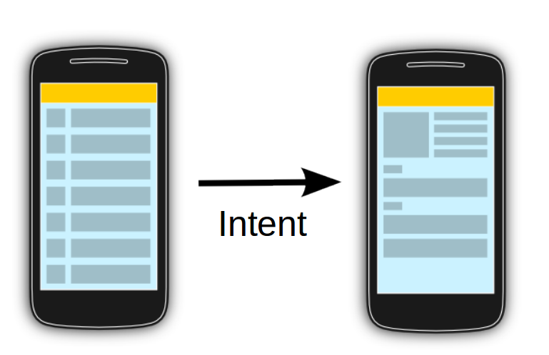
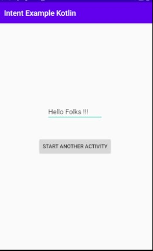
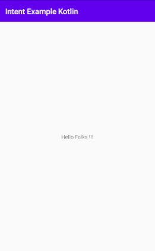

### Peringantan, mulai dari modul ini penulisan modul akan menggunakan bahasa Kotlin

# Intent



`Intent` adalah sebuah objek pesan yang digunakan untuk meminta aksi dari komponen aplikasi lain. Walaupun `Intent` memfasilitasi komunikasi antar komponen dengan beberapa cara, tetapi ada tiga cara penggunaan dasar :

- **Memulai Sebuah Activity**. Seperti penjelasan sebelumnya, `Activity` merepresentasikan sebuah layar di aplikasi. Anda bisa memulai sebuah activity baru dengan memasukkan `Intent`  ke `startActivity()`. `Intent` akan mendeskripsikan activity apa yang dimulai dan data apa yang dibawa.
- **Memulai Sebuah Service**. `Service` adalah sebuah komponen yang melakukan operasi di background tanpa ada user interface sama sekali. Kita bisa memulai `Service` dengan memasukkan `Intent` ke `startService()`.
- **Mengantarkan Broadcast**. Sebuah `Broadcast` merupakan sebuah pesan yang bisa diterima oleh aplikasi apapun yang bisa menerimanya. Anda bisa mengantarkan broadcast ke aplikasi lain dengan memasukkan `Intent` ke `sendBroadcast()` atau `sendOrderedBroadcast()`.

## Tipe-Tipe Intent

Ada dua tipe dari intent:

- **Explicit Intent**. `Intent` jenis ini akan menspesifikkan aplikasi apa yang akan memenuhi persyaratan intent, dengan menyediakan nama paket aplikasi target maupun nama class komponen yang sepenuhnya memenuhi syarat. Anda biasanya akan menggunakan `Explicit Intent` untuk memulai sebuah komponen di aplikasi Anda sendiri, karena Anda tahu nama Class dari `activity` atau `service` yang ingin dimulai. Contohnya ketika Anda akan memulai sebuah `activity` di aplikasi Anda.
- **Implicit Intent**. `Intent` jenis ini tidak menuliskan secara spesifik nama dari komponen, melainkan hanya akan mendeklarasi aksi apa yang akan dilakukan, dimana hal ini akan memperbolehkan sebuah komponen dari aplikasi lain untuk menangani tugas itu. Contohnya ketika aplikasi Anda akan menunjukkan ke user sebuah map, maka Anda akan menyuruh aplikasi lain yang mampu untuk menunjukkan lokasi di sebuah map.

## Parcelable

`Parcelable` adalah suatu interface yang memungkinkan kita untuk mengirimkan objek dari satu activity ke activity lain. Objek yang diimplementasikan dengan parcelable akan memudahkan Anda dalam mengirim data dari satu activity ke activity lain.

Contoh penggunaan :

```kotlin
@Parcelize
data class DataText (
    val text: String,
) : Parcelable
```

## Example


Gambar tersebut menunjukkan bagaimana `Intent` dibawa ke system untuk memulai `activity` lain. Sekarang kita akan membuat suatu contoh Intent yang akan membawakan data dengan menggunakan `Parcelable` dari `MainActivity` ke `DataActivity`, kira-kira gambar kedua activity-nya adalah berikut :




Untuk kodenya : 
- Kita edit dulu untuk `activiy_main.xml` seperti berikut :
```xml
<?xml version="1.0" encoding="utf-8"?>
<androidx.constraintlayout.widget.ConstraintLayout xmlns:android="http://schemas.android.com/apk/res/android"
    xmlns:app="http://schemas.android.com/apk/res-auto"
    xmlns:tools="http://schemas.android.com/tools"
    android:layout_width="match_parent"
    android:layout_height="match_parent"
    tools:context=".MainActivity">

    <EditText
        android:id="@+id/edt_text"
        android:layout_width="150dp"
        android:layout_height="wrap_content"
        android:text="@string/example_text"
        app:layout_constraintBottom_toBottomOf="parent"
        app:layout_constraintEnd_toEndOf="parent"
        app:layout_constraintHorizontal_bias="0.498"
        app:layout_constraintStart_toStartOf="parent"
        app:layout_constraintTop_toTopOf="parent"
        app:layout_constraintVertical_bias="0.381" />

    <Button
        android:id="@+id/btn_start_activity"
        android:layout_width="wrap_content"
        android:layout_height="wrap_content"
        android:text="@string/start_another_activity"
        app:layout_constraintBottom_toBottomOf="parent"
        app:layout_constraintEnd_toEndOf="parent"
        app:layout_constraintStart_toStartOf="parent"
        app:layout_constraintTop_toBottomOf="@+id/edt_text"
        app:layout_constraintVertical_bias="0.154" />


</androidx.constraintlayout.widget.ConstraintLayout>
```

- Lalu kita buat Data Class untuk Parcelable dengan nama `DataText` :
```kotlin
import android.os.Parcelable
import kotlinx.android.parcel.Parcelize

@Parcelize
data class DataText (
    val text: String,
) : Parcelable
```

- Kita buat activity baru dengan nama DataActivity dengan cara klik kanan di folder yang terdapat `MainActivity` > New > Activity > Empty Activity, lalu buat isi dari `activity_data.xml` seperti ini :
```xml
<?xml version="1.0" encoding="utf-8"?>
<androidx.constraintlayout.widget.ConstraintLayout xmlns:android="http://schemas.android.com/apk/res/android"
    xmlns:app="http://schemas.android.com/apk/res-auto"
    xmlns:tools="http://schemas.android.com/tools"
    android:layout_width="match_parent"
    android:layout_height="match_parent"
    tools:context=".DataActivity">

    <TextView
        android:id="@+id/text_transferred"
        android:layout_width="wrap_content"
        android:layout_height="wrap_content"
        android:text="@string/default_text"
        app:layout_constraintBottom_toBottomOf="parent"
        app:layout_constraintEnd_toEndOf="parent"
        app:layout_constraintStart_toStartOf="parent"
        app:layout_constraintTop_toTopOf="parent" />

</androidx.constraintlayout.widget.ConstraintLayout>
```

- Lalu isi dari DataActivity disesuaikan seperti :
```kotlin
import androidx.appcompat.app.AppCompatActivity
import android.os.Bundle
import kotlinx.android.synthetic.main.activity_data.*

class DataActivity : AppCompatActivity() {
    override fun onCreate(savedInstanceState: Bundle?) {
        super.onCreate(savedInstanceState)
        setContentView(R.layout.activity_data)

        val data = intent.getParcelableExtra<DataText>("data_text")

        text_transferred.text = data?.text.toString()
    }
}
```

- Yang terakhir, kita edit isi dari `MainActivity` seperti berikut :
```kotlin
import android.content.Intent
import androidx.appcompat.app.AppCompatActivity
import android.os.Bundle
import android.view.View
import android.widget.Toast
import kotlinx.android.synthetic.main.activity_main.*

class MainActivity : AppCompatActivity(), View.OnClickListener {
    override fun onCreate(savedInstanceState: Bundle?) {
        super.onCreate(savedInstanceState)
        setContentView(R.layout.activity_main)

        btn_start_activity.setOnClickListener(this)
    }

    override fun onClick(p0: View?) {
        when(p0?.id) {
            R.id.btn_start_activity -> {
                val text = edt_text.text.toString().trim()

                if (text.isEmpty()) {
                   Toast.makeText(this, "Text Can't Be Empty", Toast.LENGTH_SHORT).show()
                    return
                }

                val data = DataText(text)
                val intent = Intent(this, DataActivity::class.java)

                intent.putExtra("data_text", data)
                startActivity(intent)
            }
        }
    }
}
```

Disini kita menggunakan class `DataText` yang kita sesuaikan dengan Parcelable. Lalu kita isi class tersebut dengan text yang dimasukkan di `MainActivity` ke `DataActivity`.

## Sumber
- https://developer.android.com/guide/components/intents-filters
- https://www.vogella.com/tutorials/AndroidParcelable/article.html