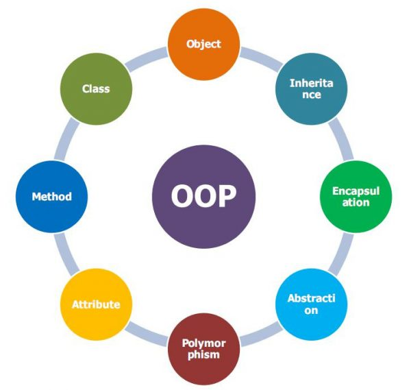
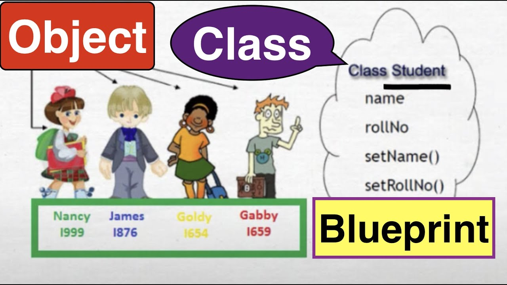
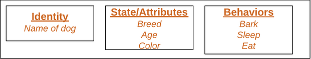
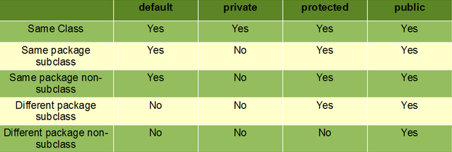
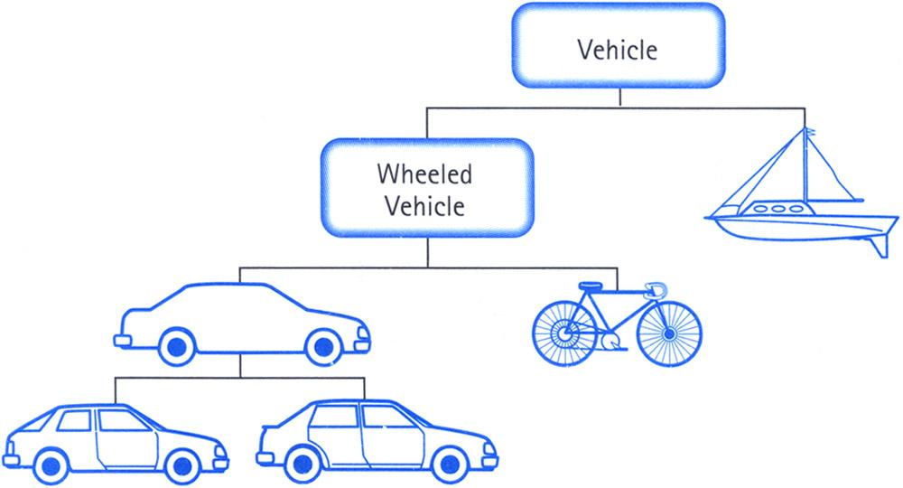
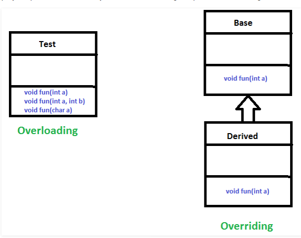

# Object-Oriented Programming (Pemrograman Berorientasi Objek)



Object-Oriented Programming atau yang biasa disingkat OOP seperti namanya merujuk kepada bahasa yang menggunakan objek dalam programming. Tujuan utama dari OOP adalah menyatukan data dan fungsi yang mengoperasikan dalam satu tempat.

Konsep OOP sendiri sangat banyak digunakan di berbagai bahasa, bahkan bahasa yang digunakan untuk membangun aplikasi Android seperti Java dan Kotlin. Jadi mempelajari OOP sangat penting untuk pemrogram Android. Sekarang mari kita pelajari konsep-konsep dari OOP.



## Class dan Object
Class dan Object merupakan konsep dasar dari OOP yang berkutat dengan entitas di dunia nyata. 

### Class
Kelas secara singkat merupakan blueprint atau prototype untuk pembuatan object. Di dalam class, Anda harus mendeklarasikan atribut dan fungsi apa saja yang dibutuhkan oleh objek yang akan dibuat dari class itu nanti. Contoh pembuatan class :

```
// Contoh dalam Java
public class Student {

    // Atribut
    String name;
    int rollNo;

    // Fungsi
    public void setName(String name) {
        this.name = name;
    }

    public void setRollNo(int rollNo) {
        this.rollNo = rollNo;
    }
}
```

```
// Contoh dalam Kotlin
class Student {

    // Atribut
    lateinit var name: String
    var rollNo: Int = 0

    // Fungsi
    fun setValName(name: String) {
        this.name = name
    }

    fun setValRollNo(rollNo: Int) {
        this.rollNo = rollNo
    }
}
```

### Object
Object merupakan unit dasar dalam OOP yang merepresentasikan entitas di dunia nyata. Sebuah object terdiri dari :
- State : Direpresentasikan oleh atribut dalam object
- Behavior : Direpresentasikan oleh fungsi dalam object
- Identity : Memberi nama unik pada suatu object dan memungkinkan satu object untuk berinteraksi dengan object lain



Contoh dari penggunaan object :
```
// Contoh dalam bahasa Java
public class Main {
    public static void main(String[] args) {
        // Pembuatan object dari class Student
        Student student = new Student();

        // Penggunaan fungsi di object student
        student.setName("Jack");
        student.setRollNo(10);

        // Penggunaan atribut di object student
        System.out.println(student.name + " has rollNo " + student.rollNo);
    }
}
```

```
// Contoh dalam bahasa Kotlin
fun main() {
    // Pembuatan object student dari class Student
    var student = Student()

    // Penggunaan fungsi object student
    student.setValName("King")
    student.setValRollNo(20)

    // Penggunaan atribut object student
    println(student.name + " has roll no " + student.rollNo)
}
```

### Constructor
Constructor merupakan fungsi spesial yang digunakan untuk menginisialisasi suatu object. Constructor dipanggil saat sebuah object dibuat dari sebuah class. Constructor bisa dipakai untuk inisialisasi nilai awal dari atribut suatu object.

Contoh :
```
// Contoh dalam bahasa Java
class Student {
    String name;

    public Student(String name) {
        this.name = name;
    }
}

public class Main {
    public static void main(String[] args) {
        Student student = new Student("Jack");
    }
}
```

```
//Contoh dalam bahasa Kotlin
// Di Kotlin constructor ditulis disamping nama class
class Student(val name: String) {
    fun introduce() {
        println(name)
    }
}

fun main() {
    val student = Student("jack")

    student.introduce()
}
```

## Encapsulation
Encapsulation adalah mekanisme dalam membungkus data (atribut) dan kode yang menggunakan data (fungsi) bersama dalam satu unit. Di dalam encapsulation, atribut dalam suatu class anak disembunyikan dari class lain dan hanya bisa diakses oleh fungsi dalam class tersebut.

Agar dapat menerapkan encapsulation, maka perlu mengerti apa itu access modifier. Access modifier sendiri membantu dalam pembatasan aksesbilitas dari suatu data. Di bawah ini ada beberapa macam access modifier dan aksesbilitas dari masing-masing access modifier:



Berdasarkan tabel tersebut, agar bisa menerapkan encapsulation maka diperlukan access modifier private. Lalu terdapat konsep fungsi getter dan setter. Getter sendiri merupakan fungsi untuk mendapat nilai dari data yang diinginkan. Setter adalah fungsi yang digunakan untuk mengubah nilai suatu data. Dalam kotlin, getter dan setter sudah otomatis dibuat oleh sistem.

Contoh penerapan encapsulation :

```
// Contoh dalam Java
public class Student2 {
    private int rollNo;

    public void setRollNo(int rollNo) {
        this.rollNo = rollNo;
    }

    public int getRollNo() {
        return this.rollNo;
    }
}
```

```
// Contoh dalam Kotlin
class Student {
    var rollNo: Int = 0
        private set

    fun setValRollNo(rollNo: Int) {
        this.rollNo = rollNo
    }
}
```

Kalian bisa mencoba di fungsi main untuk mendapat langsung data. Untuk bahasa Java kalian pasti akan mendapat error jika tidak melewati getter. Untuk Kotlin karena getter memanglah public maka bisa menggunakan cara seperti biasa. Untuk mengubah nilai suatu data maka perlu melewati setter dan tidak bisa langsung mengubah nilai di kedua bahasa tersebut.

## Inheritance
Inheritance adalah mekanisme dimana suatu class dapat mewarisi feature(data dan fungsi) dari class lain. Ada beberapa terminologi penting untuk Inheritance diantaranya :
- Super Class : Class dimana feature dari class tersebut diwarisi oleh class lain
- Sub Class : Class yang mewarisi feature dari class lain. Sub Class sendiri bisa menambah feature-nya sendiri.
- Reusability : Jika kita ingin membuat sebuah class, dan ternyata sudah ada sebuah class yang sudah memiliki beberapa data yang kita mau, maka kita bisa menurunkan class tersebut ke class yang sedang kita buat. Dengan begini, kita akan menggunakan kembali feature dari class lain.

Sedikit ilustrasi bagaimana Inheritance terjadi :



Contoh Inheritance dalam pemrograman :
```
// Contoh dalam Java
class Student2 {
    String name;

    public void setName(String name) {
        this.name = name;
    }

    public String getName() {
        return this.name;
    }
}

class InternationalStudent extends Student2 {
    String nationality;

    public void setNationality(String nationality) {
        this.nationality = nationality;
    }

    public String getNationality() {
        return nationality;
    }
}
```

```
// Contoh dalam bahasa Kotlin
open class Student {
    lateinit var name: String
}

class InternationalStudent : Student() {
    lateinit var nationality: String
}
```

Di contoh tersebut menggambarkan bahwa class International Student merupakan Sub Class dan class Student merupakan Super Class. Maka class InternationalStudent akan mendapat feature dari class Student.

## Polymorphism
Plymorphism berarti memiliki banyak bentuk. Polymorphism memungkinkan kita untuk melakukan satu aksi dengan cara yang berbeda-beda. Polymorphism bisa dilakukan dengan overloading dan overriding.



### Overloading
Overloading terjadi ketika ada beberapa fungsi dengan nama yang sama tetapi memiliki parameter yang berbeda. Overloading bisa dilakukan ke suatu fungsi dengan pembedaan dari jumlah argumen atau jenis argumen. Contoh dari overloading :

```
// Contoh dalam Java
class Student2 {
    public void introduce(int rollNo) {
        System.out.println("My Roll No is " + rollNo);
    }

    public void introduce(String name) {
        System.out.println("My name is " + name);
    }
}
```

```
// Contoh dalam Kotlin
class Student {
    fun introduce(rollNo: int) {
        println("My Roll No is " + rollNo)
    }

    fun introduce(name: String) {
        println("My name is " + name)
    }
}
```

### Overriding
Overriding terjadi jika suatu class turunan memiliki definisi berbeda untuk salah satu anggota dari Super Class nya. Contoh untuk overriding :

```
// Contoh dalam Java
class Student2 {
    String name;

    public void introduce() {
        System.out.println("My name is " + name);
    }
}

class InternationalStudent2 extends Student2 {
    String nationality;
    
    public void introduce() {
        System.out.println("My name is " + name + " and I'm from " + nationality);
    }
}
```

```
// Contoh dalam Kotlin
open class Student {
    lateinit var name: String

    fun introduce() {
        println("My name is " + name)
    }
}

class InternationalStudent : Student() {
    lateinit var nationality: String
    
    fun introduce() {
        println("My name is " + name + " And I'm from " + nationality)
    }
}
```

## Abstraction
Abstraction bisa diartikan sebagai proses untuk menuliskan hanya karakteristik yang penting dari sebuah object tanpa menuliskan detail-nya. Feature dari object itu membedakan object itu dengan object lain yang memiliki tipe sama dan juga abstraction membantu untuk mengklasifikasi/mengelompokkan object. Abstraction bisa diperoleh dengan memanfaatkan Abstract Class dan Interface.

### Abstract Class
Beberapa karakteristik dari Abstract Class :
- Abstract class didefinisikan dengan keyword `abstract`
- Fungsi Abstract adalah fungsi yang dideklarasi tanpa implementasi-nya
- Fungsi yang dideklarasi di abstract class tidak selalu harus merupakan abstract function. Abstract class bisa memiliki fungsi yang memiliki implementasi yang konkrit
- Fungsi yang didefinisikan sebagai abstract harus didefinisikan kembali di Sub Class dengan menggunakan overriding.
- Class yang memiliki satu atau lebih fungsi abstract harus dideklarasikan sebagai abstract class
- Tidak ada object yang bisa dibuat dari abstract class. Harus melalui inheritance dahulu
- Abstract class bisa memiliki constructor yang berparameter.

Contoh penggunaan abstract class:

```
// Contoh dalam Java
abstract class Student2 {
    String name;

    public void setName(String name) {
        this.name = name;
    }

    public String getName() {
        return this.name;
    }

    // Abstract function
    public abstract void introduce();
}

class InternationalStudent2 extends Student2 {
    String nationality;

    public void setNationality(String nationality) {
        this.nationality = nationality;
    }

    public String getNationality() {
        return nationality;
    }

    // Abstract function dioverride di Sub Class
    @Override
    public void introduce() {
        System.out.println("My name is " + name + " and I'm from " + nationality);
    }
}
```

```
// Contoh dalam Kotlin
abstract class Student {
    lateinit var name: String
    
    // abstract function
    abstract fun introduce()
}

class InternationalStudent : Student() {
    lateinit var nationality: String

    // override abstract function
    override fun introduce() {
        println("My name is " + name + " And I'm from " + nationality)
    }
}
```

### Interface
Interface mirip seperti abstract class, yang membedakan adalah fungsi yang dideklarasi di interface secara default adalah abstract function. Beberapa karakteristik dari interface :

- Interface menspesifikan apa yang harus class lakukan dan bukan bagaimana. Bisa dibilang interface adalah blueprint dari class
- Interface menspesifikan satu atau lebih fungsi abstact yang harus diimplemetasi oleh class.
- Jika sebuah class mengimplementasi interface dan tidak menyediakan function body untuk semua fungsi yang dideklarasi di interface, maka class tersebut haruslah abstract class

Contoh dari penggunaan interface :
```
// Contoh dalam Java
interface Student2 {
    String name = null;

    void introduce();
}

class InternationalStudent2 implements Student2 {
    String nationality;

    public void setNationality(String nationality) {
        this.nationality = nationality;
    }

    public String getNationality() {
        return nationality;
    }

    public void introduce() {
        System.out.println("My name is " + name + " and I'm from " + nationality);
    }
}
```

```
// Contoh dalam Kotlin
interface Student {
    var name: String

    fun introduce()
}

class InternationalStudent : Student {
    lateinit var nationality: String

    // override obstract function
    override fun introduce() {
        println("My name is " + name + " And I'm from " + nationality)
    }
}
```

## Beberapa Konsep Tambahan

### DRY (Don't Repeat Yourself)
Prinsip DRY berbunyi :

`Every piece of knowledge or logic must have a single, unambiguous representation within a system`

Dalam OOP, ini berarti penggunaan abstraction dengan baik. Jika ada fungsionalitas yang sama diantara class, maka bisa dibuat abstract class sebagai parent class-class itu atau menggunakan interface untuk merangkaikan fungsi-fungsi mereka.

### KISS (Keep It Simple and Stupid)
Prinsip Keep It Simple and Stupid adalah pengingat untuk menjaga agar kode Anda tetap sederhana dan mudah dibaca oleh manusia. Jika fungsi Anda menangani beberapa use-cases, bagi mereka ke dalam fungsi-fungsi yang lebih kecil. Jika fungsi itu melakukan beberapa fungsionalitas, maka buat beberapa fungsi untuk masing-masing fungsionalitas.

### SRP (Single Responsibility Principle)
Prinsip Single Responsibility Principle mengatakan bahwa tidak boleh ada dua atau lebih fungsionalitas di dalam satu class. Bunyinya :

`A class should only have one, and only one, reason to be changed.`

Dimana maksud dari `reason to be changed` adalah tanggung jawab dari class. Jika terdapat lebih dari satu tanggung jawab, maka ada lebih banyak alasan untuk mengganti class tersebut di suatu waktu.

Ini berarti jika suatu saat fungsionalitas butuh update, maka tidak ada fungsionalitas lain yang terpengaruh.

### Open/Closed Principle
Prinsip Open/Closed Principle berbunyi bahwa suatu class atau object dan fungsi harus terbuka untuk ekstensi dan tertutup untuk modifikasi.

Maksudnya adalah Anda harus mendesain class dan module Anda dengan kemungkinan update di masa depan, jadi mereka harusnya memiliki desain yang umum dimana Anda tidak perlu memodifikasi class tersebut untuk memperluas behavior-nya. 

## Sumber :
- https://www.updateilmu.com/wp-content/uploads/2015/01/oop.jpg
- https://www.geeksforgeeks.org/object-oriented-programming-oops-concept-in-java/
- https://www.geeksforgeeks.org/classes-objects-java/
- https://www.tutorialspoint.com/java/java_encapsulation.htm
- https://www.geeksforgeeks.org/access-modifiers-java/
- https://kotlinlang.org/docs/tutorials/kotlin-for-py/inheritance.html
- https://www.geeksforgeeks.org/inheritance-in-java/
- https://www.geeksforgeeks.org/polymorphism-in-java/
- https://www.geeksforgeeks.org/interfaces-in-java/
- https://www.tutorialkart.com/kotlin/kotlin-abstraction/
- https://www.geeksforgeeks.org/abstraction-in-java-2/
- https://kotlinlang.org/docs/reference/interfaces.html
- https://kotlinlang.org/docs/reference/classes.html
- https://stackabuse.com/object-oriented-design-principles-in-java/