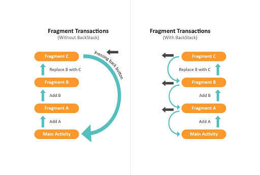
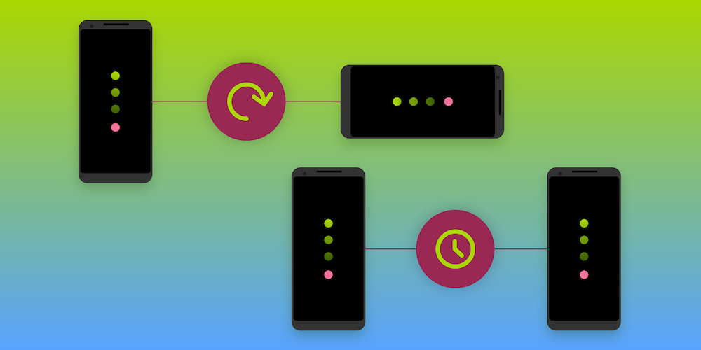
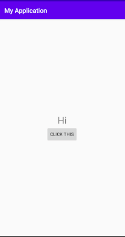

# Activity


Activity merupakan salah satu elemen penyusun dasar aplikasi di platform Android. Activity berfungsi sebagai titik awal untuk interaksi pengguna dengan aplikasi, serta merupakan pusat dari cara pengguna melakukan navigasi dalam aplikasi (seperti tombol Kembali) atau antar-aplikasi (seperti tombol Terkini). 

Dengan mengelola activity dengan benar, Anda dapat memastikan bahwa, misalnya:

- Perubahan orientasi berlangsung dengan lancar tanpa mengganggu pengalaman pengguna.
- Data pengguna tidak hilang selama transisi aktivitas.
- Sistem akan mengakhiri proses jika diperlukan.

## Activity-Lifecycle


Activity memiliki daur hidup(lifcycle) tersendiri yang terdiri dari beberapa keadaan/kondisi (state) dimulai dari onCreate hingga onDestroy berikut penjelasan singkat mengenai daur hidup activity :

### onCreate()
Method yang dijalankan ketika activity diciptakan oleh sistem, pada kondisi ini banyak dilakukan inisiasi, seperti pemanggilan perintah layout, list data dan lain-lain, contoh : `setContentView(R.layout.activity_main);`

### onStart()
Dipanggil ketika activtiy sudah muncul pada smartphone, tetapi belum bisa menerima inputan/berinteraksi dengan user, method ini diikuti oleh onResume() atau onStop().

### onResume()
Ketika sebuah activity muncul dilayar smartphone dan siap menerima input/berinteraksi dengan user, pada saat ini activity berada pada stack teratas dari activity stack, Method ini selalu diikuti oleh onPause().

### onPause()
Onpause() kebalikan dari onResume() Ketika activity masih terlihat dilayar namun tidak dapat lagi menerima input dari user, method ini diikuti onResume() atau onStop().

### onStop()
Kebalikan dari onStart() Ketika activity sudah tidak terlihat lagi dilayar dan tidak dibutuhkan, method ini diikuti onResume() atau onStop().

### onDestroy()
Ketika sebuah activity dihancurkan secara permanen oleh sistem, dapat juga dilakukan dengan fungsi finish() atau isFinishing().

### onRestart()
Ketika activity dipanggil kembali setelah menjalankan onStop(), Method ini selalu diikuti oleh onStart().

## Last In First Out (LIFO)



Activity di Android sendiri diperlakukan seperti sebuah stack (Last Inf First Out). Jadi ketika kalian membuka activity baru, activity lama akan tertindih. Ketika kalian klik tombol back, maka kalian akan kembali ke activity sebelumnya.

## Saving Activity State

Yang dimaksud dengan state disini adalah data-data yang ada di suatu activity. Salah satu hal yang harus diperhatikan agar dapat membuat aplikasi Android yang baik adalah tidak kehilangan state ketika aplikasi tersebut tidak sengaja berpindah ke backgorund ataupun saat user merotasi smartphone. Cara untuk menyimpan state adalah menggunakan method `onSaveInstanceState()`.

## Example



Kita akan mencontohkan sebuah activity sederhana seperti di gambar, dimana text yang ada di tengah-tengah layar akan berubah ketika di-klik. Lalu state text apa sebelumnya tidak akan hilang ketika kita mengganti orientasi dari layar.

View yang digunakan kira-kira seperti ini
```xml
<?xml version="1.0" encoding="utf-8"?>
<androidx.constraintlayout.widget.ConstraintLayout xmlns:android="http://schemas.android.com/apk/res/android"
    xmlns:app="http://schemas.android.com/apk/res-auto"
    xmlns:tools="http://schemas.android.com/tools"
    android:layout_width="match_parent"
    android:layout_height="match_parent"
    tools:context=".MainActivity">

    <LinearLayout
        android:layout_width="match_parent"
        android:layout_height="match_parent"
        android:orientation="vertical"
        android:gravity="center">

        <TextView
            android:layout_width="match_parent"
            android:layout_height="wrap_content"
            android:text="Hello World!"
            app:layout_constraintBottom_toBottomOf="parent"
            app:layout_constraintLeft_toLeftOf="parent"
            app:layout_constraintRight_toRightOf="parent"
            app:layout_constraintTop_toTopOf="parent"
            android:textSize="30dp"
            android:id="@+id/text"
            android:gravity="center"/>

        <Button
            android:layout_width="wrap_content"
            android:layout_height="wrap_content"
            android:text="Click This"
            android:id="@+id/change_button"/>

    </LinearLayout>

</androidx.constraintlayout.widget.ConstraintLayout>
```

Lalu ini adalah contoh dari main activity :

```java
//Contoh dalam Java
import androidx.annotation.NonNull;
import androidx.appcompat.app.AppCompatActivity;

import android.os.Bundle;
import android.os.PersistableBundle;
import android.view.View;
import android.widget.Button;
import android.widget.TextView;

public class MainActivity extends AppCompatActivity implements View.OnClickListener {
    private int string_state;
    private String[] strings = new String[2];
    private Button button;
    private TextView textView;
    private static final String STATE_STRING = "state_string";

    @Override
    protected void onCreate(Bundle savedInstanceState) {
        super.onCreate(savedInstanceState);
        setContentView(R.layout.activity_main);

        if (savedInstanceState != null) {
            string_state = savedInstanceState.getInt(STATE_STRING);
        } else string_state = 0;

        strings[0] = "Hi";
        strings[1] = "Hello";
        button = findViewById(R.id.change_button);
        textView = findViewById(R.id.text);

        button.setOnClickListener(this);
        textView.setText(strings[string_state % 2]);
    }

    @Override
    public void onClick(View view) {
        if(view.getId() == R.id.change_button) {
            string_state++;
            textView.setText(strings[string_state % 2]);
        }
    }

    @Override
    public void onSaveInstanceState(@NonNull Bundle outState) {
        super.onSaveInstanceState(outState);
        outState.putInt(STATE_STRING, string_state);
    }
}
```

```kotlin
// Contoh dalam Kotlin
import kotlinx.android.synthetic.main.activity_main.*
import androidx.appcompat.app.AppCompatActivity
import android.os.Bundle
import android.view.View
import kotlin.properties.Delegates

class MainActivity : AppCompatActivity(), View.OnClickListener {
    private val strings = arrayOf("Hi", "Hello")
    private var string_state by Delegates.notNull<Int>()

    companion object {
        private const val STATE_STRING = "state_string"
    }

    override fun onCreate(savedInstanceState: Bundle?) {
        super.onCreate(savedInstanceState)
        setContentView(R.layout.activity_main)

        if (savedInstanceState != null) {
            string_state = savedInstanceState.getInt(STATE_STRING)
        } else string_state = 0

        text.setText(strings[string_state % 2])

        change_button.setOnClickListener(this)
    }

    override fun onClick(p0: View?) {
        if(p0?.id == R.id.change_button) {
            string_state++
            text.setText(strings[string_state % 2])
        }
    }

    override fun onSaveInstanceState(outState: Bundle) {
        super.onSaveInstanceState(outState)
        outState.putInt(STATE_STRING, string_state)
    }
}
```

Jika kita tulis activity tersebut, maka ketika kita run akan menunjukkan layar seperti di gambar. Jika kita klik maka string yang terlihat akan berganti-ganti antara "Hi" dan "Hello". Lalu disitu kita juga menggunakan method `onSaveInstanceState` untuk membantu kita agar data tidak hilang ketika orientasi dari smartphone berubah. 

## Sumber :
- https://developer.android.com/guide/components/activities
- https://developer.android.com/guide/components/activities/activity-lifecycle
- https://medium.com/@sulthanalihsan5/baca-ini-anda-akan-paham-tentang-life-cycle-activity-android-ceb1a8087fbd
- https://pspdfkit.com/blog/2019/saving-the-activity-state/