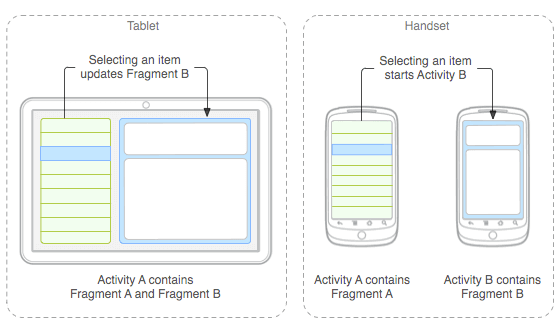
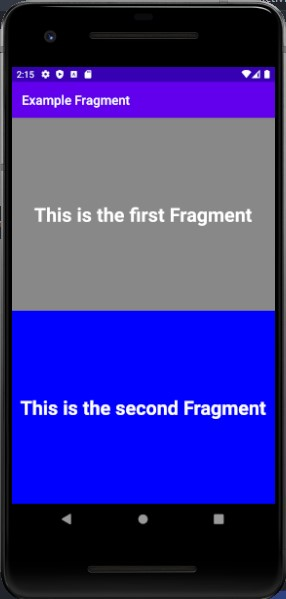

# Fragment



Anda bisa menganggap `Fragment` sebagai sebuah bagian modular dari sebuah activity. Dimana `Fragment` memiliki lifecycle nya sendiri, menerima input sendiri, dan bisa ditambahkan atau dihilangkan saat activity sedang berjalan (Seperti sub-activity yang bisa digunakan di activity lain). Anda bisa mengkombinasikan banyak `Fragment` ke sebuah activity untuk membuat UI multi-panel ataupun reuse sebuah `Fragment` ke beberapa activity.

## Lifecycle dari Fragment


`Fragment` sendiri memiliki lifecycle yang hampir mirip dengan activity. Perbedaan mendasar dari `Fragment` dengan activity adalah bagaimana penyimpanan mereka dalam back stack. Activity sendiri akan secara default ditangani oleh system. Jika di `Fragment`, jika kita tidak memanggil `addToBackStack()`, maka `Fragment` akan langsung kembali ke tampilan activity jika menekan tombol back walaupun sebelumnya ada `Fragment` lain. Gambarannya seperti ini :


## Example



Kita akan membuat aplikasi sederhana dimana `MainAcitivity` akan memiliki dua `Fragment`. Kedua `Fragment` tersebut berasal dari satu class yang sama. Tetapi kita menggunakan dua kali dengan beberapa penyesuaian parameter saat membuat objek dari class. Langkah-langkahnya adalah :

- Buat `Fragment` dengan nama `TextFragment` dengan klik kanan di folder yang ada file `MainActivity` > New > Fragment > Fragment (Blank). Lalu kita sesuaikan isi dari `fragment_text.xml` dengan :
```xml
<?xml version="1.0" encoding="utf-8"?>
<FrameLayout xmlns:android="http://schemas.android.com/apk/res/android"
    android:id="@+id/frame"
    xmlns:tools="http://schemas.android.com/tools"
    android:layout_width="match_parent"
    android:layout_height="match_parent"
    tools:context=".TextFragment">

    <TextView
        android:id="@+id/text_fragment"
        android:layout_width="match_parent"
        android:layout_height="match_parent"
        android:gravity="center"
        android:textColor="@android:color/white"
        android:textStyle="bold"
        android:textSize="30sp"
        android:text="@string/hello_blank_fragment" />

</FrameLayout>
```

- Lalu kita menyesuaikan isi dari `TextFragment.kt` menjadi :
```kotlin
import android.os.Bundle
import androidx.fragment.app.Fragment
import android.view.LayoutInflater
import android.view.View
import android.view.ViewGroup
import kotlinx.android.synthetic.main.fragment_text.*

private const val ARG_PARAM1 = "param1"
private const val ARG_PARAM2 = "param2"

class TextFragment : Fragment() {
    private var param1: String? = null
    private var param2: Int? = null

    override fun onCreate(savedInstanceState: Bundle?) {
        super.onCreate(savedInstanceState)
        arguments?.let {
            param1 = it.getString(ARG_PARAM1)
            param2 = it.getInt(ARG_PARAM2)
        }
    }

    override fun onCreateView(
        inflater: LayoutInflater, container: ViewGroup?,
        savedInstanceState: Bundle?
    ): View? {
        return inflater.inflate(R.layout.fragment_text, container, false)
    }

    override fun onViewCreated(view: View, savedInstanceState: Bundle?) {
        super.onViewCreated(view, savedInstanceState)

        text_fragment.text = param1
        param2?.let { frame.setBackgroundColor(it) }
    }

    companion object {
        @JvmStatic
        fun newInstance(param1: String, param2: Int) =
            TextFragment().apply {
                arguments = Bundle().apply {
                    putString(ARG_PARAM1, param1)
                    putInt(ARG_PARAM2, param2)
                }
            }
    }
}
```

- Untuk `activity_main.xml`, kita sesuaikan isinya menjadi :
```xml
<?xml version="1.0" encoding="utf-8"?>
<androidx.constraintlayout.widget.ConstraintLayout xmlns:android="http://schemas.android.com/apk/res/android"
    xmlns:app="http://schemas.android.com/apk/res-auto"
    xmlns:tools="http://schemas.android.com/tools"
    android:layout_width="match_parent"
    android:layout_height="match_parent"
    tools:context=".MainActivity">

    <LinearLayout
        android:layout_width="match_parent"
        android:layout_height="match_parent"
        android:orientation="vertical">

        <FrameLayout
            android:id="@+id/frame_1"
            android:layout_width="match_parent"
            android:layout_height="match_parent"
            android:layout_weight="1"/>

        <FrameLayout
            android:id="@+id/frame_2"
            android:layout_width="match_parent"
            android:layout_height="match_parent"
            android:layout_weight="1"/>
    </LinearLayout>

</androidx.constraintlayout.widget.ConstraintLayout>
```

- Lalu isi dari `MainActivity.kt` menjadi :
```kotlin
import android.graphics.Color
import androidx.appcompat.app.AppCompatActivity
import android.os.Bundle

class MainActivity : AppCompatActivity() {
    override fun onCreate(savedInstanceState: Bundle?) {
        super.onCreate(savedInstanceState)
        setContentView(R.layout.activity_main)

        createFragment()
    }

    private fun createFragment() {
        val fragmentManager = supportFragmentManager
        val fragment1 = TextFragment.newInstance("This is the first Fragment", Color.GRAY)
        val fragment2 = TextFragment.newInstance("This is the second Fragment", Color.BLUE)

        fragmentManager
                .beginTransaction()
                .add(R.id.frame_1, fragment1)
                .add(R.id.frame_2, fragment2)
                .addToBackStack(null)
                .commit()
    }
}
```

### Penjelasan
Untuk dapat memakai `Fragment`, maka kita harus membuat terlebih dahulu seperti di langkah pertama. Dari sana akan tercipta dua file, satunya berupa class untuk `Fragment` dan satunya adalah desain xml untuk `Fragment`. Kedua file tersebut sudah saling terhubung.

Lalu kita bisa membuat objek dari `Fragment` dengan fungsi `newInstance`, disitu kalian bisa menambahkan beberapa argument untuk `Fragment` kalian.

Lalu yang terakhir adalah memasukkan `Fragment` yang sudah dibuat ke activity. Untuk bisa melakukan itu maka kita membutuhkan `FragmentManager`, kita bisa mendapatkannya dengan `supportFragmentManager`. Lalu selanjutnya `FragmentManager` akan memasukkan ke activity seperti yang ditunjukkan oleh kode ini :
```kotlin
fragmentManager
        .beginTransaction()
        .add(R.id.frame_1, fragment1)
        .add(R.id.frame_2, fragment2)
        .addToBackStack(null)
        .commit()
```

Disitu kita menambahkan dua `Fragment`, jumlah dari `Fragment` yang ingin ditambahkan sendiri adalah bebas dan kalian bisa tentukan sendiri, tetapi karena kita membutuhkan dua `Fragment`, maka kita lakukan `add()` dua kali.


## Sumber
- https://developer.android.com/guide/components/fragments