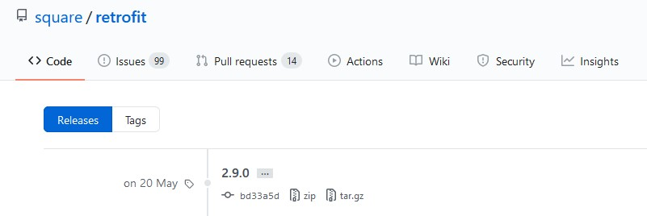

# Libraries

`Library` di Android secara struktur sama dengan Android app module. `Library` bisa termasuk apa saja yang dibutuhkan untuk membangun sebuah aplikasi, memasukkan source code, dan sebuah `Android Manifest`.

Sebuah Modul `Library` berguna untuk :
- Ketika Anda membangun beberapa aplikasi yang menggunakan beberapa komponen yang sama. Seperti activity, services, atau UI layouts.
- Ketika Anda membangun sebuah aplikasi yang ada di beberapa variasi APK, seperti versi gratis atau berbayar dan Anda membutuhkan komponen yang sama untuk keduanya.

## Beberapa Contoh Library di Android

### Retrofit
`Retrofit` adalah library yang berguna sebagai `REST API client` untuk Android. Jika sebelumnya ketika kita ingin mengakses data dari API, kita harus mengeksekusi sebuah class `Async Task` dan menggunakan `HttpsUrlConnection` untuk mendapat data. Dengan menggunakan library ini, kita bisa memanipulasi endpoint dan header, menambahkan sebuah request body dan query parameter, lalu memilih method untuk request hanya dengan anotasi di Retrofit. Kita akan belajar menggunakan library ini di modul mendatang.

### Picasso
`Picasso` adalah image library yang terpercaya dan sudah digunakan secara luas. `Picasso` mengklaim bahwa library ini adalah library image loading yang anti repot, bahkan bisa digunakan dengan satu baris kode.

### RxJava2
`Library` ini adalah library yang akan membantu Anda mengimplementasikan `Reactive Programming` di Android. Secara official library ini dideskripsikan sebagai "Sebuah library yang menyusun program asyncrhonous dan event-based dengan menggunakan urutan yang dapat diamati".

### Espresso
`Espresso` adalah sebuah test framework yang mampu membuat developer bisa melakukan user interfaces test untuk aplikasi Android. Sebagai contoh, library ini akan membantu mengecek text di suatu `TextView` apakah sama dengan text lain atau tidak. 

## Menambahkan Library ke Aplikasi Kita
Karena kita menggunakan `Android Studio`, maka kita memakai `Gradle` sebagai otomatisasi build system untuk aplikasi Android kita. Sebagai contoh, kita akan mencoba menambahkan `Retrofit` ke aplikasi kita. Langkah-langkahnya adalah :
- Buka file `build.gradle (Module: app)` 

- Kita cari versi dan cara penulisan implementasi `Retrofit` di build.gradle. Biasanya untuk versi bisa dilihat di repository `Github` dari library tersebut

- Lalu kita tambahkan penulisan implementasi tersebut ke blok `depedencies {...}`

- Akan muncul perintah untuk melakukan Sync di gradle, langsung kita klik saja

## Sumber

- https://developer.android.com/studio/projects/android-library
- https://appinventiv.com/blog/best-android-libraries/
- https://square.github.io/retrofit/
- https://github.com/square/retrofit