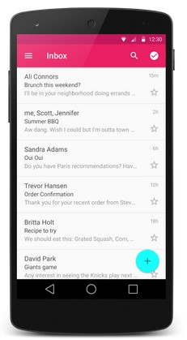
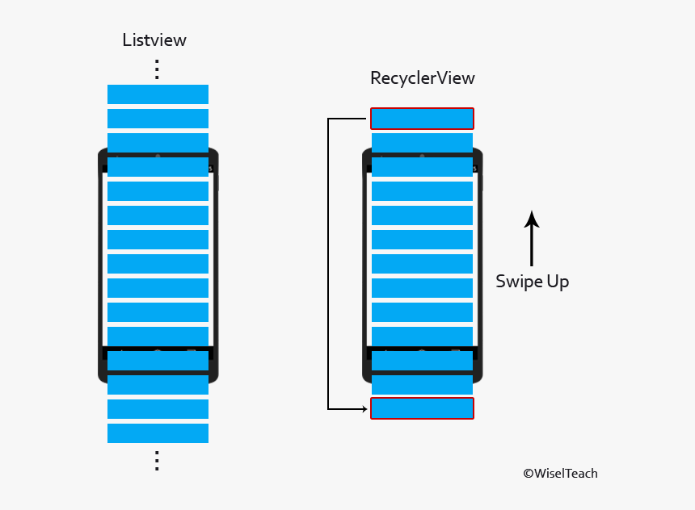
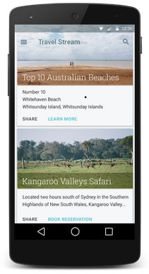

# RecyclerView & CardView

## RecyclerView



`RecyclerView` adalah versi yang lebih canggih dan lebih fleksibel dibanding dengan `ListView`. Maka disini kami langsung mengajarkan tentang `RecyclerView`. 

Dalam model `RecyclerView`, beberapa komponen akan bekerja sama untuk menampilkan data Anda. Kita bisa mendefinisikan sendiri seperti apa layout dari item yang kita inginkan dengan menggunakan layouting xml. Anda juga bisa menggunakan layout manager standard (seperti `LinearLayoutManager` atau `GridLayoutManager`) atau mengimplementasikan layout manager versi Anda sendiri.

Views di list direpresentasikan oleh object `View Holder`. Object ini adalah instance dari class yang didefinisikan dengan mewarisi class `RecyclerView.ViewHolder`. Setiap `View Holder` bertanggung jawab untuk menampilkan satu item di sebuah view. Contohnya, jika kita memiliki daftar dari koleksi musik, maka setiap `View Holder` mungkin akan merepresentasikan sebuah album. 



Karakteristik unik dari `RecyclerView`  lainnya adalah tidak seperti `ListView` yang akan generate semua item sekaligus, sedangkan `RecyclerView` hanya akan generate item sesuai dengan yang ditampilkan dan beberapa item di atas dan bawahnya saja, selebihnya item yang sudah pernah terlihat dan sedang tidak terlihat akan disimpan jika akan digunakan kembali. Hal ini sangat berdampak ke performa aplikasi, bayangkan jika ada 1000 item maka `ListView` benar-benar akan cukup berat dalam memuatnya sedangkan `RecyclerView` tidak terlalu bermasalah.

### Penggunaan RecyclerView

1. Tambahkan implementasi `RecyclerView` di `build.gradle` seperti di modul sebelumnya
```implementation 'com.android.support:recyclerview-v7:28.0.0'```

2. Tambahkan `RecyclerView` ke layout activity maupun fragment
```xml
<?xml version="1.0" encoding="utf-8"?>
<!-- A RecyclerView with some commonly used attributes -->
<android.support.v7.widget.RecyclerView
    android:id="@+id/my_recycler_view"
    android:scrollbars="vertical"
    android:layout_width="match_parent"
    android:layout_height="match_parent"/>
```

3. Buat suatu class adapter untuk `RecyclerView`
```kotlin
class MyAdapter(private val myDataset: Array<String>) :
        RecyclerView.Adapter<MyAdapter.MyViewHolder>() {

    // Provide a reference to the views for each data item
    // Complex data items may need more than one view per item, and
    // you provide access to all the views for a data item in a view holder.
    // Each data item is just a string in this case that is shown in a TextView.
    class MyViewHolder(val textView: TextView) : RecyclerView.ViewHolder(textView)


    // Create new views (invoked by the layout manager)
    override fun onCreateViewHolder(parent: ViewGroup,
                                    viewType: Int): MyAdapter.MyViewHolder {
        // create a new view
        val textView = LayoutInflater.from(parent.context)
                .inflate(R.layout.my_text_view, parent, false) as TextView
        // set the view's size, margins, paddings and layout parameters
        ...
        return MyViewHolder(textView)
    }

    // Replace the contents of a view (invoked by the layout manager)
    override fun onBindViewHolder(holder: MyViewHolder, position: Int) {
        // - get element from your dataset at this position
        // - replace the contents of the view with that element
        holder.textView.text = myDataset[position]
    }

    // Return the size of your dataset (invoked by the layout manager)
    override fun getItemCount() = myDataset.size
}
```

4. Lalu sambungkan adapter ke activity atau fragment tempat tag `RecyclerView` tadi
```kotlin
class MyActivity : Activity() {
    private lateinit var recyclerView: RecyclerView
    private lateinit var viewAdapter: RecyclerView.Adapter<*>
    private lateinit var viewManager: RecyclerView.LayoutManager

    override fun onCreate(savedInstanceState: Bundle?) {
        super.onCreate(savedInstanceState)
        setContentView(R.layout.my_activity)

        viewManager = LinearLayoutManager(this)
        viewAdapter = MyAdapter(myDataset)

        recyclerView = findViewById<RecyclerView>(R.id.my_recycler_view).apply {
            // use this setting to improve performance if you know that changes
            // in content do not change the layout size of the RecyclerView
            setHasFixedSize(true)

            // use a linear layout manager
            layoutManager = viewManager

            // specify an viewAdapter (see also next example)
            adapter = viewAdapter

        }
    }
    // ...
}
```

## CardView



Sering kali aplikasi perlu menampilkan data dalam container dengan gaya yang mirip. Container ini sering digunakan dalam daftar untuk menampung informasi setiap item. Sistem menyediakan `CardView` sebagai cara mudah untuk menampilkan informasi di dalam kartu yang memiliki tampilan konsisten di seluruh platform. Kartu ini memiliki elevasi default di atas grup tampilan yang menampungnya, sehingga sistem menggambar bayangan di bawahnya. Kartu memberikan cara mudah untuk menampung sekelompok tampilan, sekaligus memberikan gaya yang konsisten untuk container.  

### Penggunaan CardView
1. Menambahkan depedensi `CardView` seperti di modul sebelumnya
```implementation 'com.android.support:cardview-v7:28.0.0'```

2. Tambahkan `CardView` ke layout file. Gunakan sebagai `ViewGroup` yang menampilkan View lain.
```xml
<LinearLayout xmlns:android="http://schemas.android.com/apk/res/android"
    xmlns:tools="http://schemas.android.com/tools"
    xmlns:card_view="http://schemas.android.com/apk/res-auto"
    ... >
    <!-- A CardView that contains a TextView -->
    <android.support.v7.widget.CardView
        xmlns:card_view="http://schemas.android.com/apk/res-auto"
        android:id="@+id/card_view"
        android:layout_gravity="center"
        android:layout_width="200dp"
        android:layout_height="200dp"
        card_view:cardCornerRadius="4dp">

        <TextView
            android:id="@+id/info_text"
            android:layout_width="match_parent"
            android:layout_height="match_parent" />
    </android.support.v7.widget.CardView>
</LinearLayout>
```

## Sumber
- https://developer.android.com/guide/topics/ui/layout/recyclerview