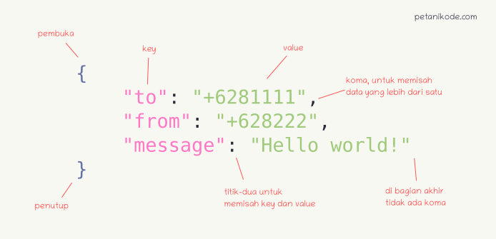

# Connecting Apps to Internet

Jika kita membuat suatu aplikasi Android, seringkali kita diharuskan untuk mendapatkan suatu data dari sumber tertentu di internet. Secara umum cara mendapatkan data itu dengan cara menyambungkan aplikasi kita dengan suatu `Web API` (Application Programming Interface) lalu menerima data dengan bentuk `JSON` (JavaScript Object Notation). Kita mulai dahulu modul ini dengan penjelasan dari kedua istilah tersebut.

## Web API


Istilah `API` sendiri merujuk kepada function, protocols, atau tools yang memungkinkan seorang developer untuk mengintegrasikan dua bagian dari aplikasi atau dengan aplikasi yang berbeda secara bersamaan. Tujuan utama dari penggunaan `API` ini sendiri adalah untuk mempercepat proses development dengan menyediakan function secara terpisah sehingga developer tidak perlu membuat fitur serupa.

`Web API` seperti sebuah alamat web (end point) yang dibuat untuk menanggapi beberapa request dengan memberikan kembalian sesuai dengan request yang diterima. `Web API` sendiri terkadang membutuhkan beberapa parameter sebagai data yang dibutuhkan agar dapat menampilkan hasil yang diinginkan, dan juga terkadang membutuhkan suatu kode otentikasi sebagai pertanda sudah diizinkan untuk melihat data yang diminta.

## JSON



`JSON` (JavaScript Object Notation) adalah sebuah format data yang digunakan untuk pertukaran dan penyimpanan data. `JSON` merupakan bagian dari bahasa pemrograman `JavaScript` dan bisa dibaca oleh berbagai bahasa pemrograman seperti C, C++, C#, Java, JavaScript, Perl, Python, dan lain-lain. Hal ini membuat `JSON` sebagai format yang ideal untuk pertukaran data antar aplikasi.

Aturan dari penulisan `JSON` sudah tertulis di gambar yang tertera. Sebagai tambahan, untuk value sendiri kita bisa memberikan tipe data apapun bahkan jika diisi dengan array maupun object.

## Mengambil Data dari Web API dengan Retrofit

Disini kita akan menggunakan Library `Retrofit` untuk mendapatkan data dari internet. Disini saya memberi sedikit contoh dengan menggunakan `Web API` dari Github untuk melihat user Github. Anda bisa melihat dokumentasi dari `Web API` Github [disini](https://developer.github.com/v3/users/) Langkah-langkah nya adalah sebagai berikut :

1. Tambahkan tag dibawah ini di file `AndroidManifest.xml` di luar dari tag application. Hal ini dilakukan agar aplikasi mendapat izin untuk connect ke internet
```<uses-permission android:name="android.permission.INTERNET" />```

2. Kita masukkan beberapa Library di bawah ini ke `build.gradle` dan lakukan Sync
```
implementation 'com.squareup.retrofit2:retrofit:2.9.0'
implementation 'com.squareup.retrofit2:converter-gson:2.9.0'
implementation 'com.squareup.okhttp3:okhttp:4.8.1'
implementation 'com.google.code.gson:gson:2.8.5'
```

3. Kita buat suatu data class sesuai dengan bentuk kembalian dari `Web API`
```kotlin
data class ResultUserListItems (
    val total_count: Int,
    val incomplete_results: Boolean,
    val items: Array<UserListItem>
)

data class UserListItem (
    val login: String,
    val avatar_url: String
)
```

4. Kita buat suatu interface untuk endpoint dari `Web API` dan langsung definisikan bentuk dan kembalian dari setiap endpoints
```kotlin
interface GithubEndpoints {
    @GET("search/users?")
    fun getUsers(@Query("q") q: String): Call<ResultUserListItems>
}
```

5. Kita buat object untuk service. Disini kita juga bisa menambahkan header dengan mengikuti beberapa jawaban [ini](https://stackoverflow.com/questions/32605711/adding-header-to-all-request-with-retrofit-2)
```kotlin
object GithubService {
    private val client = OkHttpClient
        .Builder()
        .build()

    private val retrofit = Retrofit.Builder()
        .baseUrl("https://api.github.com/")
        .addConverterFactory(GsonConverterFactory.create())
        .client(client)
        .build()

    fun<T> buildService(service: Class<T>): T{
        return retrofit.create(service)
    }
}
```

6. Lalu kita tinggal gunakan object yang sudah dibuat tadi untuk mendapat data dari `Web API`
```kotlin
val username = "kuuhaku86" 
val request = GithubService.buildService(GithubEndpoints::class.java)
val call = request.getUsers(username)
val listItems = ArrayList<UserListItem>()

call?.enqueue(object : retrofit2.Callback<ResultUserListItems> {
    override fun onResponse(
        call: Call<ResultUserListItems>,
        response: Response<ResultUserListItems>
    ) {
        if (response.body()?.total_count ?:0  > 0) {
            val responseData = response.body() as ResultUserListItems

            for (item in responseData.items) {
                listItems.add(item)
            }

            listUser.postValue(listItems)
        }
    }

    override fun onFailure(call: Call<ResultUserListItems>, t: Throwable) {
        Log.e("main_view_model_error", t.message.toString())
    }
})
```

## Sumber

- https://www.codepolitan.com/mengenal-apa-itu-web-api-5a0c2855799c8
- https://www.petanikode.com/json-pemula/