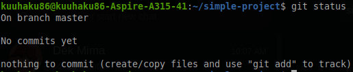
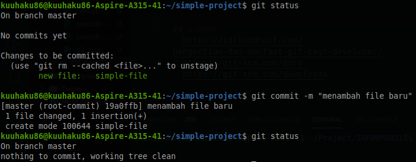
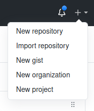
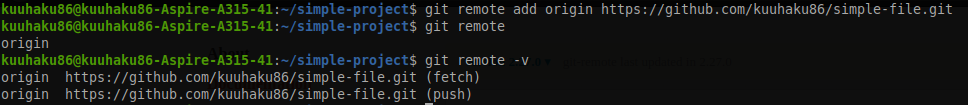
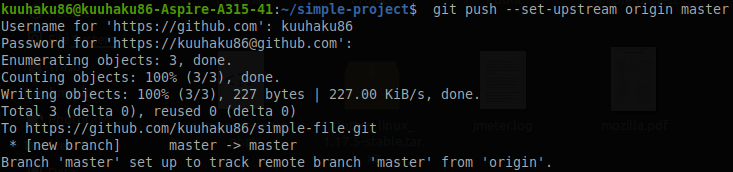
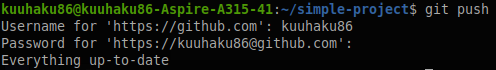
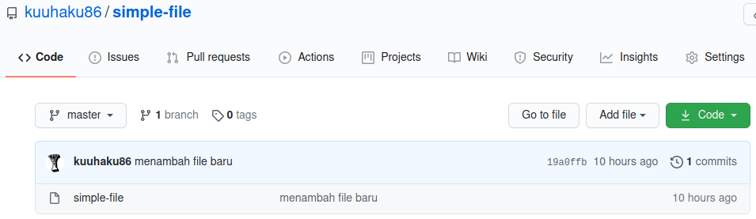
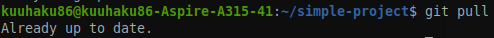
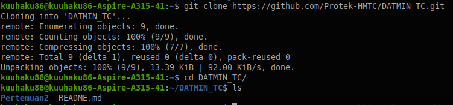

# Git dan Github

## Git


Ketika Anda mengembangkan sebuah software sendiri, mungkin tidak sulit untuk mengingat perubahan-perubahan yang telah dilakukan ke software tersebut. Tetapi ketika Anda mengembangkan software dengan teman-teman Anda atau bahkan dengan developer di seluruh dunia, melihat perubahan-perubahan pada software tersebut akan menjadi sangat sulit. Disinilah diciptakan sebuah sistem yang bernama *version control system*, dimana sistem ini membantu semua developer yang bekerja pada software mengetahui perubahan-perubahan apa saja yang telah dilakukan ke suatu software. Git merupakan *version control system* yang paling terkenal saat ini. Selain karena kemudahannya, Git menjadi terkenal karena komunitas nya sangatlah besar. Disini kita akan belajar sedikit mengenai penggunaan git. Git sendiri sebenarnya berbasis CLI (*Command Line Interface*), tetapi sekarang sudah sangat banyak tool ber-GUI (*Graphic User Interface*) yang dapat memudahkan para developer dalam menggunakan Git. Sebelum menggunakan Git, pastikan Git sudah terinstal di OS kalian. Sekarang kita akan belajar mengenai command-command di Git ketika kamu bekerja secara lokal (komputer-mu sendiri).

## Command Git untuk Bekerja di Lokal

### *git init*
Ketika ingin project kita ter-track oleh Git, maka kita perlu menginisialisasi git ke dalam project kita. caranya adalah dengan menjalankan command ```git init``` di dalam repository. 


### *git  status*
```git status``` berguna untuk melihat status dari repository di branch yang aktif, branch adalah percabangan dari project dan biasanya digunakan untuk pembagian tugas.




### *git add*
```git add``` berguna untuk mempersiapkan perubahan untuk dimasukkan ke track terbaru dari branch.


### *git commit*
```git commit``` memasukkan perubahan yang sudah di persiapkan di ```git add``` ke branch.



## Github


Github merupakan hosting platform untuk version control dan kolaborasi. Artinya Github membuat Anda dan orang lain bisa bekerja bersama dalam suatu project dari manapun. Disini kamu bisa upload project kamu sebagai suatu repository dan menambahkan collaborator untuk project mu itu. Repository itu seperti folder untuk suatu project, repository project-mu mengandung semua file project-mu dan semua history revisi dari project-mu. 

### Membuat Repository di Github
Agar bisa menyimpan code project-mu di Github, hal pertama yang harus dilakukan adalah membuat repository. Secara umum kamu harus membuat repository secara manual di web Github, tetapi ada beberapa software yang menawarkan membuat repository secara otomatis di akun github-mu. Disini kita akan memberi contoh untuk membuat repository secara manual di web github.

- Klik tombol ```+``` di pojok kanan atas halaman Github dan pilih new repository.
  


- Isikan nama dari repository dan hak akses (public atau privat), lalu klik tombol ```Create Repository```.


- Lalu akan muncul beberapa cara memasukkan kode project kita ke repository di Github, karena project yang kita miliki sudah ada Git di dalamnya maka kita akan menggunakan cara yang ditunjukkan ```…or push an existing repository from the command line```. Untuk penjelasan langkah-langkah nya akan kita pelajari di bagian selanjutnya.

## Command Git untuk Bekerja Secara Remote
Command-command yang di tuliskan di bagian ini bertujuan agar project kita bisa dimasukkan ke repository Github.

### *git remote*
Berfungsi untuk mengatur beberapa repository yang tersambung dengan project kita.



### *git push*
Berfungsi untuk mengupdate repository yang sudah di sambungkan sesuai dengan commit terakhir dari project kita.



Untuk inisalisasi push pertama memang memiliki command sedikit panjang, tetapi selanjutnya Anda bisa melakukan command push hanya dengan ```git push```



Dan repository Github kita akan terupdate dengan sendirinya.



### *git pull*
Berfungsi untuk memasukkan perubahan yang sudah ada di remote repository ke branch di lokal. Biasanya apabila teman satu tim melakukan perubahan ke repository dan project di lokal kita belum memiliki perubahan itu, kita bisa menggunakan command ini untuk menyesuaikan perubahan ke project di lokal kita.



### *git clone*
Berfungsi jika kita ingin memasukkan sebuah repository ke lokal kita sebagai sebuah folder baru. Kita bisa melakukan itu dengan mendefinisikan url dari repository tersebut setelah command ```git clone```



## Penutup
Modul ini hanya men-cover beberapa perintah Git sederhana. Sebenarnya masih banyak command git yang belum tercover di modul ini dan sangat berguna seperti ```git branch```, ```git checkout```, ```git diff```, ```git merge```, ```git revert```, ```git reset```, ```git stash```, dan ```git apply```. Command-command tersebut bisa dipelajari lebih lanjut di sumber yang telah dicantumkan ke modul.

## Sumber
- https://idcloudhost.com/pengertian-dan-manfaat-git-bagi-developer/
- https://git-scm.com/docs
- https://git-scm.com/downloads
- https://guides.github.com/activities/hello-world/
- https://docs.github.com/en/github/creating-cloning-and-archiving-repositories/about-repositories