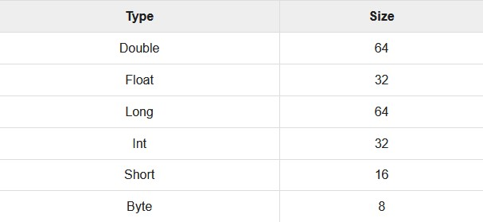
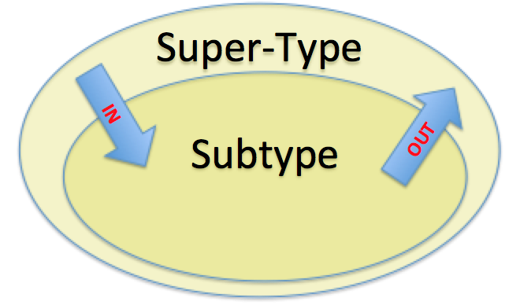

# Programming With Kotlin


Kotlin adalah sebuah bahasa pemrograman yang diperkenalkan oleh JetBrains, pembuat IDE Java terbaik yaitu Intellij IDEA. Bahasa ini adalah bahasa static yang bersifat strong typed dan berjalan diatas JVM. Pada tahun 2017, Google mengumumnakn bahwa Kotlin adalah bahasa official untuk pengembangan Android, hal ini juga mendasari pemakaian Kotlin sebagai bahasa yang digunakan di semua modul komunitas ini. Kotlin adalah bahasa open source yang menggabungkan fitur OOP dan fungsional programming menjadi sebuah platform unik.

## Basic Types

### Numbers

Berikut ini adalah daftar tipe data numbers dan ukurannya di Kotlin :



```kotlin
fun main(args: Array<String>) {
   val a: Int = 10000
   val d: Double = 100.00
   val f: Float = 100.00f
   val l: Long = 1000000004
   val s: Short = 10
   val b: Byte = 1
   
   println("Your Int Value is $a")
   println("Your Double  Value is $d")
   println("Your Float Value is $f")
   println("Your Long Value is $l")
   println("Your Short Value is $s")
   println("Your Byte Value is $b")
}
```

### Characters

Merepresentasikan satu karakter, seperti di bahasa pemrograman lain.

```kotlin
fun main(args: Array<String>) {
   val letter: Char    // defining a variable 
   letter = 'A'        // Assigning a value to it 
   println("$letter")
}
```

### Boolean

Memiliki dua nilai, `true` atau `false`.

```kotlin
fun main(args: Array<String>) {
   val letter: Boolean   // defining a variable 
   letter = true         // Assinging a value to it 
   println("Your character value is "+"$letter")
}
```

### Strings

Anda bisa concatenate string dengan operator `+`

```kotlin
fun main(args: Array<String>) {
   var rawString :String  = "I am Raw String!"
   val escapedString : String  = "I am escaped String!\n"
   
   println("Hello!"+escapedString)
   println("Hey!!"+rawString)   
}
```

### Arrays

Kumpulan dari data yang sejenis.

```kotlin
fun main(args: Array<String>) {
   val numbers: IntArray = intArrayOf(1, 2, 3, 4, 5)
   println("Hey!! I am array Example"+numbers[2])
}
```

### Collections

Ada banyak jenis `Collections` di Kotlin, tetapi pada umumnya akan dibagi menjadi dua jenis yaitu `immutable collection` (lists, maps, dan sets yang tidak bisa diubah) dan `mutable collection` (yang bisa diubah). Dengan `Collections`, Kotlin menyediakan beberapa fungsi yang berguna seperti `first()`, `last()`, `filter()`, dll. 

```kotlin
fun main(args: Array<String>) {
   val items = listOf(1, 2, 3, 4)
   println("First Element of our list----"+items.first())
   println("Last Element of our list----"+items.last())
   println("Even Numbers of our List----"+items.
      filter { it % 2 = = 0 })   // returns [2, 4]
   
   val readWriteMap = hashMapOf("foo" to 1, "bar" to 2)
   println(readWriteMap["foo"])  // prints "1"
   
   val strings = hashSetOf("a", "b", "c", "c")
   println("My Set Values are"+strings)
}
```

### Ranges

`Ranges` akan membantu iterasi di suatu jarak. Untuk menggunakannya di Kotlin maka harus memakai operator `..`

```kotlin
fun main(args: Array<String>) {
   val i:Int  = 2
   for (j in 1..4) 
   print(j) // prints "1234"
   
   if (i in 1..10) { // equivalent of 1 < = i && i < = 10
      println("we found your number --"+i)
   }
}
```

## Control Flow

### If - Else

```kotlin
if (/*expression*/) {
   // some code
} else if (/*expression 2*/) {
   // some code
} else {
   // some code
}
```

### When

Mirip `switch` jika di bahasa pemrograman lain

```kotlin
   val x:Int = 5
   when (x) {
      1 -> print("x = = 1")
      2 -> print("x = = 2")
      
      else -> { // Note the block
         print("x is neither 1 nor 2")
      }
   }
```

### For

Ada beberapa variasi dari penggunaan `for` di Kotlin.

```kotlin
   val items = listOf(1, 2, 3, 4)
   for (i in items) println("values of the array"+i)

   for ((index, value) in items.withIndex()) {
      println("the element at $index is $value")
   }
```

### While Loop dan Do-While

```kotlin
   var x:Int = 0
   
   while(x< = 10) {
      println(x)
      x++
   }

   x = 0

   do {
      x = x + 10
      println("I am inside Do block---"+x)
   } while(x <= 50)
```

### Return, Break, Continue

Benar-benar mirip bahasa pemrograman lain, tetapi kita bisa memberi label ke perulangan yang dimaksud.

```kotlin
   myLabel@ for(x in 1..10) { // appling the custom label
      if(x == 5) {
         println("I am inside if block with value"+x+"\n-- hence it will close the operation")
         break@myLabel //specifing the label
      } else {
         println("I am inside else block with value"+x)
         continue@myLabel
      }
   }
```

## Class

Cukup mirip dengan beberapa bahasa pemrograman lain, tetapi ada beberapa variasi yang perlu diperhatikan

```kotlin
Class myClass { // class Header 

   // class Body
}
```

### Nested Class

Class yang berada di dalam class lain. Secara default akan static sehingga tidak perlu membuat object dari class tersebut.

```kotlin
class Outer {
   class Nested {
      fun foo() = "Welcome to The TutorialsPoint.com"
   }
}
```

### Inner Class

Hampir mirip dengan `Nested Class`, tetapi data member dari class di luarnya bisa diakses oleh class yang lebih dalam.

```kotlin
fun main(args: Array<String>) {
   val demo = Outer().Nested().foo() // calling nested class method
   print(demo)
}

class Outer {
   private val welcomeMessage: String = "Welcome to the TutorialsPoint.com"
   inner class Nested {
      fun foo() = welcomeMessage
   }
}
```

### Anonymous Inner Class

Ini adalah konsep dimana Anda bisa membuat object dari sebuah interface, tetapi dengan syarat langsung override fungsi yang ada pada interface tersebut. Ini adalah fitur yang sangat berguna.

```kotlin
fun main(args: Array<String>) { 
   var programmer :Human = object:Human // creating an instance of the interface 
      { 
         override fun think(){ // overiding the think method 
            print("I am an example of Anonymous Inner Class ") 
         } 
      } 
                     
   programmer.think() 
} 

interface Human{ 
    fun think() 
}
```

### Type Aliases

Berfungsi untuk mengganti nama tipe yang terlalu panjang menjadi lebih pendek.

```kotlin
typealias NodeSet = Set<Network.Node>
typealias FileTable<K> = MutableMap<K, MutableList<File>>
```

## Constructor

Set Up `Contstructor` cukup spesial, seperti jika kita ingin membuat fungsi.

```kotlin
class Person(val firstName: String, var age: Int) {
   // class body
}
```

Tetapi Kotlin sendiri menyediakan opsi untuk menggunakan 2 `Constructor`, jika pemrogram ingin menambahkan beberapa logic ke dalam `Constructor`

```kotlin
fun main(args: Array<String>) {
   val HUman = HUman("TutorialsPoint.com", 25)

   print("${HUman.message}"+"${HUman.firstName}"+
      "Welcome to the example of Secondary  constructor, Your Age is-${HUman.age}")
}

class HUman(val firstName: String, var age: Int) {
   val message:String  = "Hey!!!"
      constructor(name : String , age :Int ,message :String):this(name,age) {
      }
}
```

## Inheritance

Kita bisa melakukan `Inheritance` pada Kotlin dengan operator `:`. Tetapi untuk membuat suatu class yang bisa diwarisi oleh class lain, kita harus menambahkan keyword `open` di depan class tersebut.

```kotlin
open class ABC {
   fun think () {
      print("Hey!! i am thiking ")
   }
}

class BCD: ABC(){ // inheritence happend using default constructor 
}
```

Lalu agar fungsi bisa di-override, maka tambahkan keyword `open` di depan fungsi tersebut.

```kotlin
open class ABC {
   open fun think () {
      print("Hey!! i am thinking ")
   }
}

class BCD: ABC() { // inheritance happens using default constructor 
   override fun think() {
      print("I Am from Child")
   }
}
```

Seperti pada Java, Kotlin hanya memperbolehkan suatu class untuk mewarisi hanya satu class.

## Interface

Di dalam Kotlin, `Interface` diperbolehkan untuk memiliki deskripsi dari suatu fungsi. Lalu tidak seperti `Inheritance`, Kotlin memperbolehkan implementasi lebih dari satu `Interface`. 

```kotlin
interface A {
   var myVar: Int
   fun absMethod() :String

   fun printMe() {
      println(" method of interface A")
   }
}
interface B  {
   fun printMeToo() {
      println("I am another Method from interface B")
   }
}

// implements two interfaces A and B
class multipleInterfaceExample: A, B {
   override var myVar: Int = 25
   override fun absMethod() = "Happy Learning"
}
```

## Visibility Control

### Private

Apapun yang dideklarasi secara `private`, maka hanya bisa diakses oleh scope yang melingkupinya. 

```kotlin
private class privateExample {
   private val i = 1
   private val doSomething() {
   }
}
```

Class `privateExample` hanya bisa diakses oleh kode di dalam file yang sama.

### Protected

Variabel atau fungsi yang dideklarasi dengan `protected` hanya bisa diakses oleh kelas turunannya.

```kotlin
class A() {
   protected val i = 1
}
class B : A() {
   fun getValue() : Int {
      return i
   }
}
```

### Public

Dideklarasi secara `public` berarti bisa diakses dimana saja di project workspace.

```kotlin
class publicExample {
   val i = 1
   fun doSomething() {
   }
}
```

### Internal

Apapun yang dideklarasi dengan `internal`, maka hanya dapat diakses dalam internal field. `Internal Package` hanya bisa diakses di dalam modul yang sama. `Internal Class` hanya bisa diakses oleh class di dalam package yang sama. 

```kotlin
class internalExample {
   internal val i = 1
   internal fun doSomething() {
   }
}
```

Variable `i` dan fungsi `doSomething()` hanya bisa diakses dalam package yang sama.

## Extension

Dengan `Extension`, kita bisa menambah atau mengurangi beberapa fungsi tanpa mewarisi atau memodifikasi mereka. `Extension` tidak benar-benar memodifikasi class yang ada, tetapi akan membuat suatu fungsi yang bisa dipanggil dengan operator `.`.

### Function Extension

Di `Functin Extension`, Kotlin memperbolehkan mendefinisikan sebuah fungsi diluar main class.

```kotlin
class Alien {
   var skills : String = "null"
	
   fun printMySkills() {
      print(skills)
   }		
}

fun main(args: Array<String>) {
   var  a1 = Alien()
   a1.skills = "JAVA"
   //a1.printMySkills()
	
   var  a2 = Alien()
   a2.skills = "SQL"
   //a2.printMySkills()
	
   var  a3 = Alien()
   a3.skills = a1.addMySkills(a2)
   a3.printMySkills()
}

fun Alien.addMySkills(a:Alien):String{
   var a4 = Alien()
   a4.skills = this.skills + " " +a.skills
   return a4.skills
}
```

### Object Extension

Kotlin menyediakan mekanisme lain untuk mengimplementasi fungsionalitas static dari Java dengan menggunakan keyword `companion object`. Dengan mekanisme ini, kita bisa membuat fungsi factory dan memanggil fungsi itu dengan nama class nya. Selain itu kita bisa menaruh variabel lain yang ingin dibuat static dalam scope keyword tersebut.

```kotlin
fun main(args: Array<String>) {
   println("Heyyy!!! ${A.show()} ${A.name}")
}

class A {
   companion object {
      val name = "Jack"

      fun show():String {
         return("You are learning Kotlin from TutorialsPoint.com")
      }
   }
}
```

## Data Class

`Data Class` sendiri adalah class yang hanya memegang basic data. Kita tidak bisa membuat suatu fungsi di dalam class ini. Tetapi `Data Class` memiliki beberapa fungsi in-built seperti `toString()` dan `hashCode()`. 

```kotlin
fun main(args: Array<String>) {
   val book: Book = Book("Kotlin", "TutorialPoint.com", 5)
   println("Name of the Book is--"+book.name) // "Kotlin"
   println("Puclisher Name--"+book.publisher) // "TutorialPoint.com"
   println("Review of the book is--"+book.reviewScore) // 5
   book.reviewScore = 7
   println("Printing all the info all together--"+book.toString()) 
   //using inbuilt function of the data class 
   
   println("Example of the hashCode function--"+book.hashCode())
}

data class Book(
   val name: String, 
   val publisher: String, 
   var reviewScore: Int
)
```

## Generics 

`Generics` didesain untuk type system yang memungkinkan sebuah type atau fungsi untuk beroperasi di object dengan berbagai type data sementara menyediakan compile-time type safety. `Generics` di Kotlin mirip dengan di Java.

```kotlin
fun main(args: Array<String>) {
   var objet = genericsExample<String>("JAVA")
   var objet1 = genericsExample<Int>(10)
}

class genericsExample<T>(input:T) {
   init {
      println("I am getting called with the value "+input)
   }
}
```

Tetapi Kotlin memperkenalkan keyword `in` dan `out` untuk `Generics`.

```kotlin
interface Production<out T> {
    fun produce(): T
}

interface Consumer<in T> {
    fun consume(item: T)
}
```



Dengan `out`, kita bisa memasukkan sebuah class subtype ke class super-type.

```kotlin
val production1 : Production<Burger> = FoodStore()  // Error
val production2 : Production<Burger> = FastFoodStore()  // Error
val production3 : Production<Burger> = InOutBurger()
```

Dengan `in`, kita bisa memasukkan class super-type ke class subtype

```kotlin
val consumer1 : Consumer<Food> = Everybody()
val consumer2 : Consumer<Food> = ModernPeople()  // Error
val consumer3 : Consumer<Food> = American()  // Error
```

## Functions

Di Kotlin, kita harus mendeklarasi fungsi dengan keyword `fun`. Lalu argument di dalam tanda kurung `()` dengan format `name: type` dan return type setelah tanda `:`.

```kotlin
fun <nameOfFunction>(<argument>:<argumentType>):<ReturnType>
```

Contoh :

```kotlin
fun main(args: Array<String>) {
   println(MyFunction("tutorialsPoint.com"))
}

fun MyFunction(x: String): String {
   var c:String  = "Hey!! Welcome To ---"
   return (c+x)
}
```

### Lambda Functions

Lambda adalah high-level function yang mereduksi boiler plate code ketika mendeklarasi sebuah fungsi dan mendefinisikannya. Di Kotlin, Anda bisa mendeklarasi `Lambda Function` dan memasukkannya ke sebuah fungsi.

```kotlin
fun main(args: Array<String>) {
   val mylambda :(String)->Unit  = {s:String->print(s)}
   val v:String = "TutorialsPoint.com"
   mylambda(v)
}
```

Contoh ketika passing `Lambda Function` ke sebuah fungsi :

```kotlin
fun main(args: Array<String>) {
   val mylambda:(String)->Unit  = {s:String->print(s)}
   val v:String = "TutorialsPoint.com"
   myFun(v,mylambda) //passing lambda as a parameter of another function 
}

fun myFun(a :String, action: (String)->Unit) { //passing lambda 
   print("Heyyy!!!")
   action(a)// call to lambda function
}
```

## Destructuring Declarations

Kotlin menyediakan fitur dimana Anda bisa mendeklarasi beberapa variabel dalam satu waktu dari suatu object.

```kotlin
fun main(args: Array<String>) {
   val s = Student("TutorialsPoint.com","Kotlin")
   val (name,subject) = s
   println("You are learning "+subject+" from "+name)
}

data class Student( val a :String,val b: String ){
   var name:String = a
   var subject:String = b
}
```

## Exception Handling

`Exception Handling` di Kotlin cukup mirip dengan Java. Semua `Exceptions` merupakan turunan dari class `Throwable`. 

```kotlin
fun main(args: Array<String>) {
   try {
      val myVar:Int = 12;
      val v:String = "Tutorialspoint.com";
      v.toInt();
   } catch(e:Exception) {
      e.printStackTrace();
   } finally {
      println("Exception Handeling in Kotlin");
   }
}
```

## Null Safety

Ini adalah fitur spesial di Kotlin. Type system di Koltin bertujuan untuk mengeliminasi `NullPointerException` dari kode kita dimana error ini sering muncul di Java.

### Pengecekan `null` conditions

Mirip denga if-else biasa

```kotlin
val l = if (b != null) b.length else -1
```

### Safe Calls

Safe call operator adalah `?.`.

```kotlin
val a = "Kotlin"
val b: String? = null
println(b?.length)
println(a?.length)
```

Ini akan mengembalikan `b.length` jika `b` tidak `null`, dan `null` jika `b` adalah `null`. Jika kita membuat variabel dengan type seperti `Int`, maka kita tidak bisa memasukkan ke fungsi yang membutuhkan type `Int?`. Safe calls operator sendiri bisa digunakan secara chaining :

```kotlin
bob?.department?.head?.name
```

### Elvis Operator

Jika kita memiliki variabel `b`, dan kita ingin code seperti "Jika `b` tidak `null`, pakai itu, atau pakai nilai `non-null` jika `b` adalah `null`".

```kotlin
val l: Int = if (b != null) b.length else -1
```

Dengan `Elvis Operator` (`?:`), hal ini bisa disederhanakan menjadi :

```kotlin
val l = b?.length ?: -1
```

Lalu kita bisa mengembangkannya dengan beberapa modifikasi :

```kotlin
fun foo(node: Node): String? {
    val parent = node.getParent() ?: return null
    val name = node.getName() ?: throw IllegalArgumentException("name expected")
    // ...
}
```

### Operator `!!`

Operator ini akan mengkonversi value apapun menjadi `non-null` type dan `throws` sebuah `exception` jika nilai tersebut adalah `null`.

```kotlin
val l = b!!.length
```

### Safe Casts

Casts biasa akan menghasilkan `ClassCastException` jika object memiliki type yang tidak sesuai. Dengan menggunakan `Safe Cast`, akan mengembalikan `null` jika percobaan casting tidak berhasil.

```kotlin
val aInt: Int? = a as? Int
```

## Sumber

- https://www.tutorialspoint.com/kotlin/index.htm
- https://en.wikipedia.org/wiki/Generics_in_Java
- https://medium.com/mobile-app-development-publication/in-and-out-type-variant-of-kotlin-587e4fa2944c
- https://kotlinlang.org/docs/reference/null-safety.html